# 01. Flujo principal EEG-MIDI

## Objetivo del diagrama

Mostrar el flujo principal final-v4 desde adquisicion EEG real hasta salida MIDI fisica.

## Que incluye

- ADS1299 y firmware MCU.
- `Bridge.notify("eeg_block_uV")`.
- Receiver, buffer, DSP, quality gate y sonificacion.
- Scheduler/transporte MIDI.
- `Bridge.call("midi_bytes")` y UART MIDI OUT.
- WebUI como observador/control ligero.

## Que excluye

- Benchmarks detallados.
- Capturas y tools offline.
- LED matrix.
- Rutas legacy como `eeg_frame_uV`.
- Endpoints de test MIDI.

## Diagrama Mermaid

```mermaid
flowchart LR
  electrodes["Electrodos EEG"] --> ads["ADS1299-4PAG"]
  ads -->|SPI RDATAC + DRDY| mcu["Firmware STM32U585\nsketch.ino"]
  mcu --> filters["Filtros MCU\nfilters.h"]
  filters --> blocks["Bloques uV x8\nstreaming.h"]
  blocks -->|Bridge.notify eeg_block_uV| rx["EEGReceiver\nreceiver.py"]
  rx --> contract["eeg_contract.py\nparse + status"]
  rx -->|drain blocks| backend["BackendService\norquestacion runtime\nbackend_service.py"]
  backend -->|add_block_uV + compute_live_features| buffer["EEGSignalProcessor\nbuffer uV->V"]
  buffer --> dsp["DSPCore\nPSD multitaper + bandpowers"]
  dsp --> quality["compute_spectral_quality\nquality gate"]
  quality --> sonif["SonificationFeatureAdapter\ncontroles final-v4"]
  sonif --> music["MusicSegment + Bar + Note\nnotas musicales"]
  music --> scheduler["MidiScheduler\nmidi_live.py"]
  scheduler --> transport["MidiByteTransport"]
  transport -->|Bridge.call midi_bytes| midiHandler["firmware midi_bytes"]
  midiHandler --> uart["Serial1 / D1\nTX invertido"]
  uart --> midiOut["MIDI OUT fisico"]

  web["WebUI\nweb_server.py + assets"] -.->|root/main/scale + panic| backend
  backend -.->|snapshot + music.recent_notes| web
```

## Notas de correspondencia con archivos reales

- `sketch/sketch.ino` contiene el loop de adquisicion, handlers Bridge y MIDI UART.
- `sketch/streaming.h` emite el payload manual de 8 muestras.
- `python/eeg_contract.py` centraliza constantes y parser.
- `python/backend_service.py` es el orquestador del runtime Python/Linux: drena `EEGReceiver`, alimenta `EEGSignalProcessor`, dispara DSP/quality, actualiza sonificacion, genera eventos musicales, bombea MIDI y publica snapshot.
- La WebUI no controla directamente `SonificationFeatureAdapter` ni `MidiScheduler`; envia configuracion musical y `panic` a `BackendService`, y recibe snapshots con `music.recent_notes`.
- `assets/app.js` renderiza el snapshot y usa `music.recent_notes` para el piano roll.

## Advertencias de simplificacion

El diagrama no elimina `CaptureManager`, LED, benchmarks ni tools. Solo los deja fuera del flujo principal porque no son necesarios para explicar EEG->MIDI en tiempo real.
