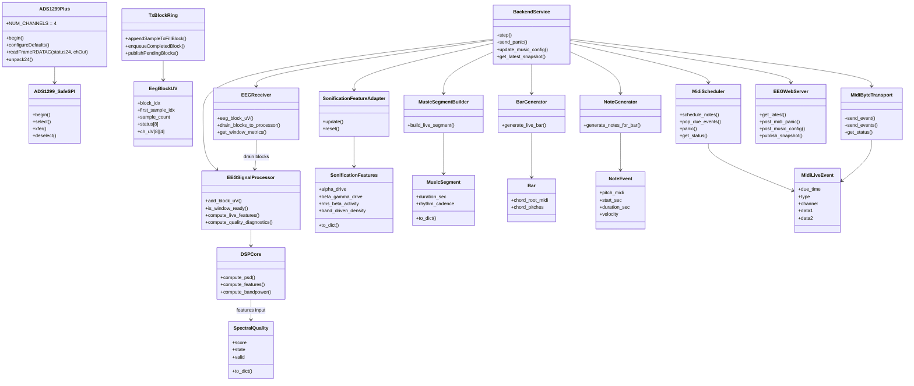

# 02. Diagrama de clases principal

## Objetivo del diagrama

Representar las clases y estructuras principales que sostienen el runtime EEG->MIDI final-v4.

## Que incluye

- Driver ADS1299 y streaming firmware.
- Receiver, buffer, DSP y quality gate.
- Sonificacion, generacion musical, scheduler y transporte MIDI.
- WebUI como consumidor de snapshot y emisor de controles ligeros.

## Que excluye

- Tools offline.
- Benchmarks.
- Capturas experimentales.
- Clases LED, salvo mencion secundaria en notas.
- Funciones legacy y helpers internos.

## Diagrama Mermaid

## Notas de correspondencia con archivos reales

- `SpectralQuality` es la dataclass de `python/spectral_quality.py`; se crea con `compute_spectral_quality()`.
- `SonificationFeatures` conserva alias legacy, pero el UML principal debe usar nombres final-v4.
- `EEGWebServer` no calcula DSP ni musica; solo expone rutas, socket y assets.
- `CaptureManager`, `LedMatrixConfig` y `LedMatrixTransport` son secundarios.

## Advertencias de simplificacion

El diagrama no muestra todas las funciones privadas de `backend_service.py`, `music_bar.py` ni `music_note.py`. Es intencional: para UML principal importa la responsabilidad, no cada helper.
