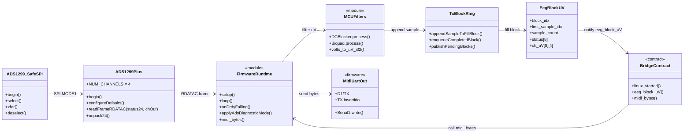
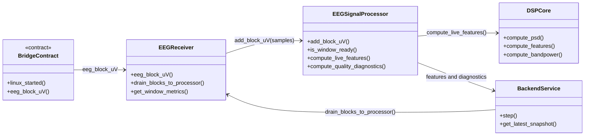
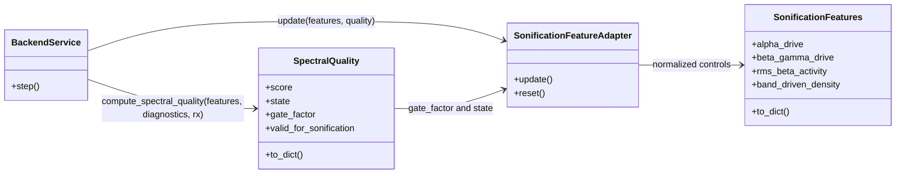
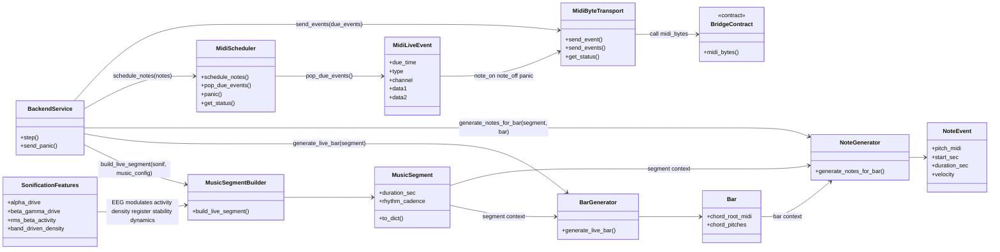
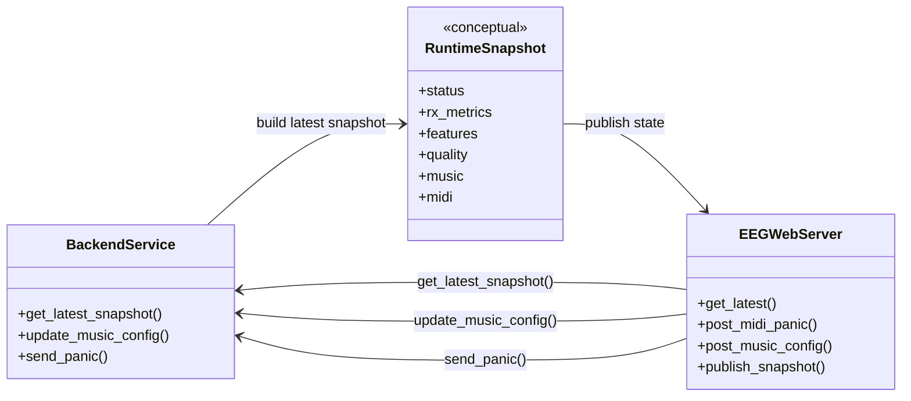
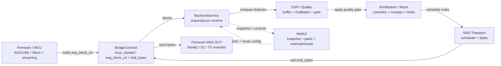

# 02. Diagrama de clases principal

## Objetivo del diagrama

Representar con claridad las clases, estructuras y modulos conceptuales que sostienen el runtime EEG->MIDI final-v4, separando el mundo firmware/MCU del mundo Python/Linux.

La intencion no es convertir cada funcion C++ en una clase real, sino hacer defendible el reparto de responsabilidades en una memoria de ingenieria.

## Que incluye

- Firmware/MCU: runtime del sketch, ADS1299, SPI seguro, filtros MCU, bloques de streaming, contrato Bridge y salida UART MIDI.
- Python/Linux: backend, receiver, buffer EEG, DSP, quality gate, sonificacion, generacion musical, scheduler MIDI, transporte `midi_bytes` y WebUI.
- Una vista resumida de arquitectura por modulos grandes.
- Etiquetas de relacion para los contratos principales: `notify eeg_block_uV`, `call midi_bytes`, `drain blocks`, `compute features`, `apply quality gate`, `schedule notes` y `send bytes`.

## Que excluye

- `CaptureManager`, que queda como runtime lateral de captura.
- `LedMatrixTransport` y LED matrix, que quedan como consumidor opcional de `music.recent_notes`.
- Tools offline.
- Benchmarks.
- Capturas y reportajes experimentales.
- Funciones legacy como `eeg_frame_uV`, `compute_online_features`, `generate_bars` y `generate_notes_for_segment`.
- Helpers privados internos que no aportan claridad al UML principal.

## Diagramas Mermaid

### 2.1 Vista firmware/MCU y contrato Bridge

Lectura: esta vista compacta el firmware en modulos conceptuales. El flujo EEG sale del ADS1299, pasa por filtros y bloque de streaming, y cruza a Python por `eeg_block_uV`. La ruta MIDI vuelve desde Bridge al firmware y termina en UART fisica.

### 2.2 Vista Python runtime EEG->MIDI

Lectura: esta vista se divide en subdiagramas para evitar una cadena lineal falsa. `BackendService` aparece varias veces porque es el orquestador del ciclo live: drena recepcion, dispara DSP, calcula calidad, actualiza controles de sonificacion, genera eventos musicales, bombea MIDI y publica snapshot.

#### 2.2A Ingesta y procesamiento EEG

#### 2.2B Quality gate y adaptacion de sonificacion

#### 2.2C Generacion musical y MIDI

Lectura: `root`, `main` y `scale` vienen de controles de usuario/WebUI dentro de `music_config`; no son inferencias directas del EEG. El EEG modula actividad, densidad, registro, estabilidad, dinamica y probabilidad. `MidiScheduler` agenda `note_on`, `note_off` y `panic`; `MidiByteTransport` envia el contrato `midi_bytes`.

#### 2.2D Snapshot y WebUI auxiliar

### 2.3 Vista resumida de arquitectura por modulos

Lectura: esta vista elimina detalle de clases para explicar el sistema en una diapositiva o figura de memoria. La WebUI aparece como rama lateral de observacion y control; no participa en el DSP pesado.

## Notas de correspondencia con archivos reales

- `FirmwareRuntime`, `MCUFilters`, `BridgeContract`, `MidiUartOut` y `RuntimeSnapshot` son modulos o conceptos para documentacion UML. Representan responsabilidades de `sketch/sketch.ino`, `filters.h`, contratos Bridge, salida UART MIDI y estado publicado; no implican que existan como clases C++ reales.
- `ADS1299Plus`, `ADS1299_SafeSPI`, `EegBlockUV` y `TxBlockRing` si corresponden a clases/estructuras C++ reales o estructuras definidas en headers.
- `BackendService` aparece en varias vistas porque orquesta RX, DSP, quality, sonificacion, MIDI y snapshot desde `python/backend_service.py`.
- `SpectralQuality` representa el resultado de `compute_spectral_quality()` en `python/spectral_quality.py`; el calculo lo invoca `BackendService` usando features y diagnostics.
- `SonificationFeatures` conserva alias legacy, pero el UML principal prioriza nombres final-v4.
- `EEGWebServer` es auxiliar: no calcula DSP ni genera musica; expone rutas, socket y assets para observar estado y enviar controles ligeros.
- `MidiByteTransport` no accede a UART directamente; solo llama `Bridge.call("midi_bytes", n, b0, b1, b2)`.
- Las flechas pueden representar dependencia, llamada o entrega de datos segun la etiqueta de la relacion.

## Advertencias de simplificacion

- Dividir el diagrama en varias vistas evita flechas cruzadas y hace mas defendible cada responsabilidad.
- El UML principal oculta `CaptureManager`, `LedMatrixTransport`, tools offline, benchmarks y capturas porque son laterales o de validacion, no el nucleo EEG->MIDI.
- El diagrama representa dependencias conceptuales y de flujo; no debe usarse como receta para mover archivos o refactorizar codigo.
