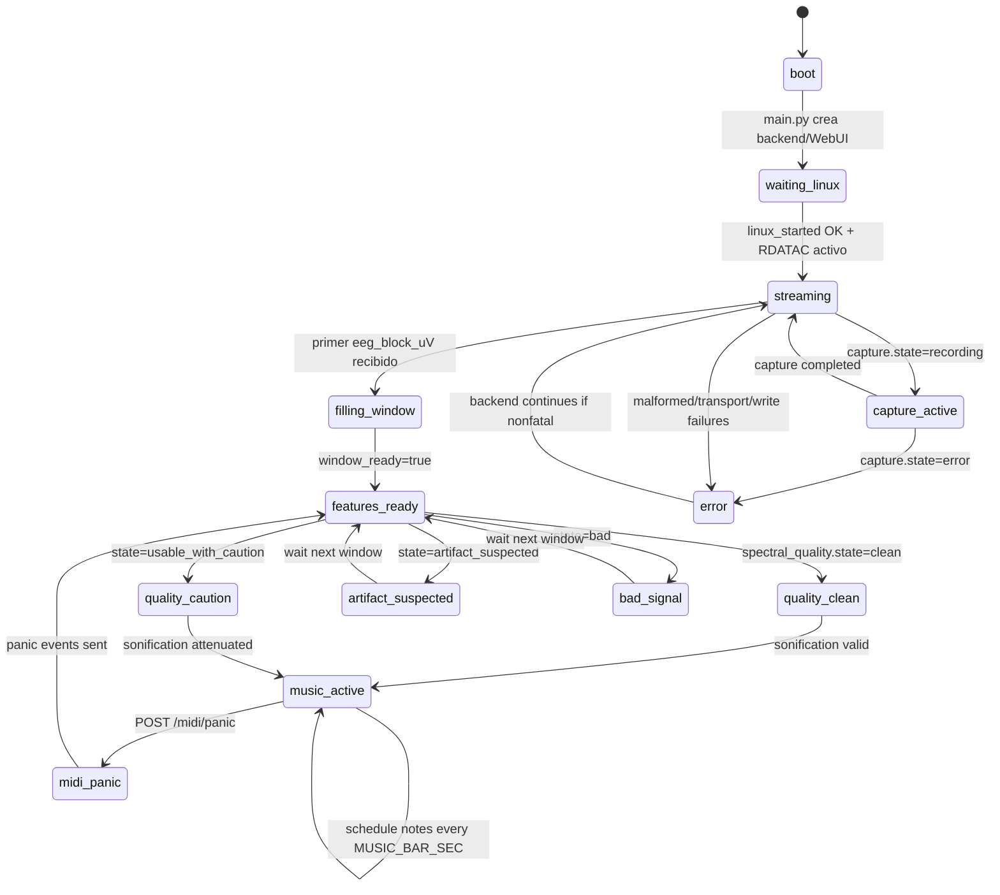

# 03. Diagrama de estados runtime

## Objetivo del diagrama

Mostrar los estados conceptuales del runtime final-v4 y su relacion con campos reales del snapshot.

## Que incluye

- Arranque y espera de Linux/Bridge.
- Recepcion EEG y llenado de ventana DSP.
- Estados de quality gate.
- Musica activa, panic MIDI, captura opcional y error.

## Que excluye

- Estados internos del ADS1299.
- Estados detallados del scheduler MIDI por nota.
- Estados de tools offline.
- Detalles de reconexion WebSocket.

## Diagrama Mermaid

## Notas de correspondencia con archivos reales

| Estado UML | Campo real principal | Archivo |
| --- | --- | --- |
| `boot` | `main.py` ejecuta `create_backend_service()` y `EEGWebServer()` | `python/main.py` |
| `waiting_linux` | Handler `linux_started` | `python/receiver.py`, `sketch/sketch.ino` |
| `streaming` | `rx.rx_blocks_total > 0` | `python/backend_service.py` |
| `filling_window` | `status.state=waiting_for_window` | `python/backend_service.py` |
| `features_ready` | `status.state=features_ready`, `window_ready=true` | `python/backend_service.py` |
| `quality_clean` | `spectral_quality.state=clean` | `python/spectral_quality.py` |
| `quality_caution` | `spectral_quality.state=usable_with_caution` | `python/spectral_quality.py` |
| `artifact_suspected` | `spectral_quality.state=artifact_suspected` | `python/spectral_quality.py` |
| `bad_signal` | `spectral_quality.state=bad` | `python/spectral_quality.py` |
| `music_active` | `music.recent_notes`, scheduler status | `python/backend_service.py`, `python/midi_live.py` |
| `midi_panic` | `POST /midi/panic`, `send_panic()` | `python/web_server.py`, `python/backend_service.py` |
| `capture_active` | `capture.state=recording` | `python/capture_manager.py` |
| `error` | `errors.*`, `capture.state=error`, MIDI failures | `python/backend_service.py` |

## Advertencias de simplificacion

Estos estados son conceptuales. El codigo no contiene una unica maquina de estados centralizada; los estados se infieren del snapshot, de contadores y de modulos runtime.
