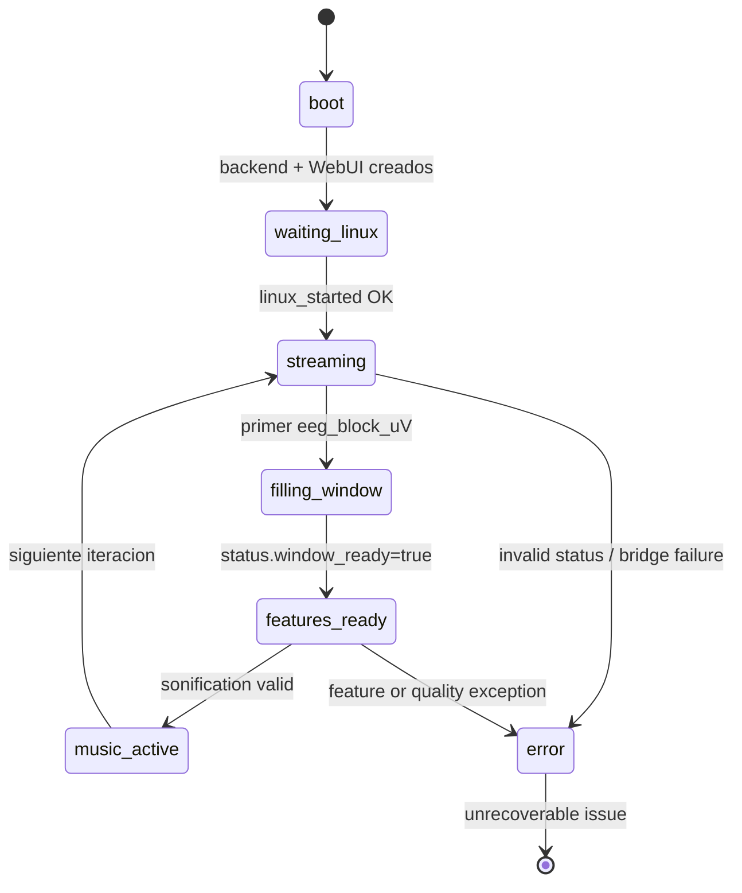
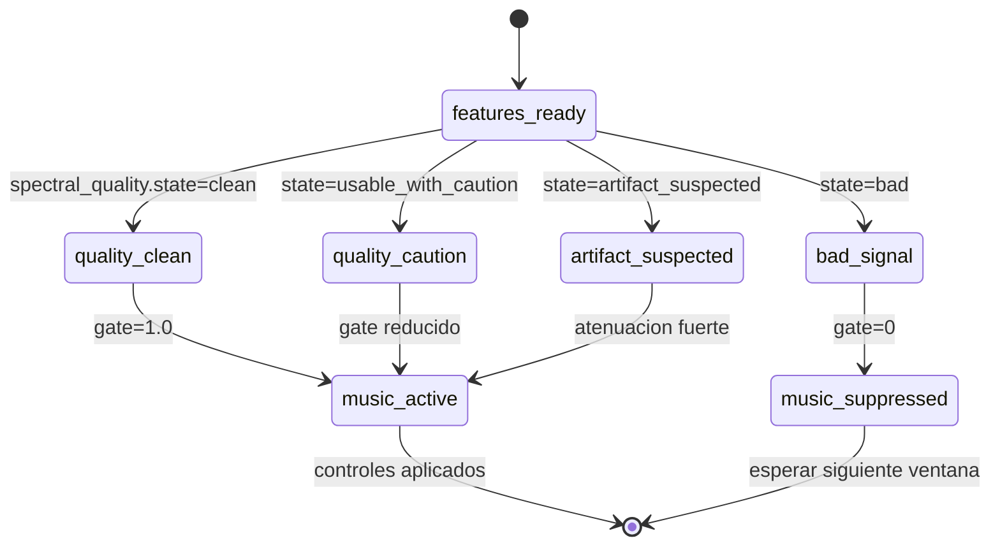
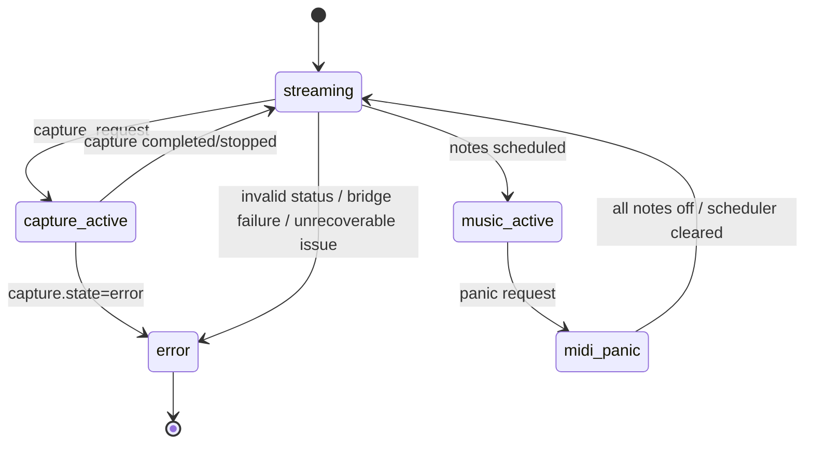

# 03. Diagrama de estados runtime

## Objetivo del diagrama

Mostrar los estados conceptuales del runtime final-v4 sin mezclar en una sola figura adquisicion, calidad espectral, musica, captura y errores.

Los estados se derivan del snapshot y del comportamiento real del backend. No hay una unica maquina de estados centralizada en codigo.

## Que incluye

- Ciclo principal de ejecucion: boot, espera de Linux, streaming, ventana DSP, features y musica.
- Subestado de quality gate segun `spectral_quality.state` y `spectral_quality.gate_factor`.
- Estados auxiliares de captura, panic MIDI y error.
- Relacion con campos reales del snapshot: `status.state`, `status.window_ready`, `spectral_quality.state`, `spectral_quality.gate_factor`, `capture.state`, `midi.scheduler` y `music.recent_notes`.

## Que excluye

- Estados internos detallados del ADS1299.
- Estados de bajo nivel del scheduler por cada nota.
- Estados de tools offline.
- Reconexion WebSocket y polling fallback.
- LED matrix, que es un consumidor opcional lateral.

## Diagramas Mermaid

### 3.1 Estado principal de ejecucion

Lectura: este diagrama muestra el ciclo general del backend. `music_active` significa que se estan generando o planificando eventos musicales; no garantiza sonido fisico si `MidiByteTransport` estuviera desactivado o si el firmware no aceptara `midi_bytes`.

### 3.2 Subestado de calidad espectral

Lectura: esta vista explica como `spectral_quality.state` condiciona la sonificacion. El estado `music_suppressed` es conceptual: representa que no se genera nueva musica util cuando el gate invalida la ventana.

### 3.3 Estados auxiliares

Lectura: esta vista separa acciones operativas laterales para evitar que ensucien el ciclo principal. Captura y panic son importantes, pero no son el flujo normal de features->musica.

## Notas de correspondencia con archivos reales

| Estado UML | Campo real principal | Archivo |
| --- | --- | --- |
| `boot` | `main.py` ejecuta `create_backend_service()` y `EEGWebServer()` | `python/main.py` |
| `waiting_linux` | Handler `linux_started` | `python/receiver.py`, `sketch/sketch.ino` |
| `streaming` | `rx.rx_blocks_total > 0`, `rx.rx_frame_rate_hz`, `rx.rx_block_rate_hz` | `python/backend_service.py`, `python/receiver.py` |
| `filling_window` | `status.state=waiting_for_window`, `status.window_ready=false` | `python/backend_service.py` |
| `features_ready` | `status.state=features_ready`, `status.window_ready=true` | `python/backend_service.py` |
| `quality_clean` | `spectral_quality.state=clean`, `spectral_quality.gate_factor` alto | `python/spectral_quality.py` |
| `quality_caution` | `spectral_quality.state=usable_with_caution` | `python/spectral_quality.py` |
| `artifact_suspected` | `spectral_quality.state=artifact_suspected` | `python/spectral_quality.py` |
| `bad_signal` | `spectral_quality.state=bad`, gate conceptualmente bloqueante | `python/spectral_quality.py` |
| `music_active` | `music.recent_notes`, `midi.scheduler.queued_events`, `midi.scheduler.active_notes` | `python/backend_service.py`, `python/midi_live.py` |
| `music_suppressed` | Estado conceptual derivado de quality gate no valido | `python/backend_service.py`, `python/sonification_features.py` |
| `midi_panic` | `POST /midi/panic`, `send_panic()`, scheduler cleared | `python/web_server.py`, `python/backend_service.py`, `python/midi_live.py` |
| `capture_active` | `capture.state=recording` | `python/capture_manager.py` |
| `error` | `errors.*`, `capture.state=error`, fallos MIDI/RX no recuperables | `python/backend_service.py`, `python/capture_manager.py` |

## Advertencias de simplificacion

- Los estados son conceptuales y se infieren del snapshot, contadores y rutas de backend; no son una maquina de estados unica implementada como clase.
- `music_active` no garantiza sonido fisico. El sonido depende tambien de `midi.transport.enabled`, `MidiByteTransport`, `Bridge.call("midi_bytes")`, firmware `midi_bytes()` y UART MIDI OUT.
- `music_suppressed` es un nombre UML conceptual para explicar el caso `bad_signal`; no es un campo literal del snapshot.
- Dividir los estados en tres diagramas evita flechas cruzadas y separa adquisicion, quality gate y acciones auxiliares.
