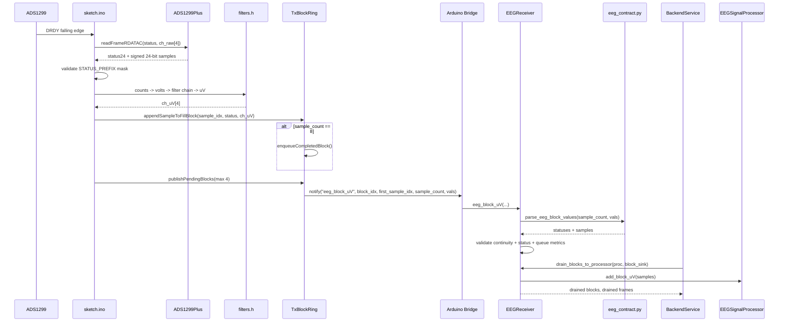

# 04. Diagrama de secuencia de adquisicion

## Objetivo del diagrama

Describir la secuencia runtime desde DRDY del ADS1299 hasta la entrada de bloques en el buffer DSP Python.

## Que incluye

- DRDY/RDATAC.
- Reconstruccion y filtrado MCU.
- Cola `TxBlockRing`.
- `Bridge.notify("eeg_block_uV")`.
- Parser/validacion Python.
- Drenado al `EEGSignalProcessor`.

## Que excluye

- Generacion MIDI.
- Capturas offline y benchmarks.
- Logs detallados de Monitor.
- Modo sintetico.

## Diagrama Mermaid

## Notas de correspondencia con archivos reales

- `BLOCK_SAMPLES` vale `8` en `sketch/streaming.h` y `python/eeg_contract.py`.
- Python valida longitud, `sample_count`, continuidad por indices y status.
- `drdy_count` no debe interpretarse como FIFO de muestras; si hay acumulacion, el firmware registra perdida/jitter.
- El backend tambien pasa bloques al `CaptureManager` como ruta lateral.

## Advertencias de simplificacion

El diagrama omite detalles de `BenchStats`, `pending > 1`, latencias de `Bridge.notify` y prints Monitor. Esos elementos son observabilidad, no contrato funcional principal.
