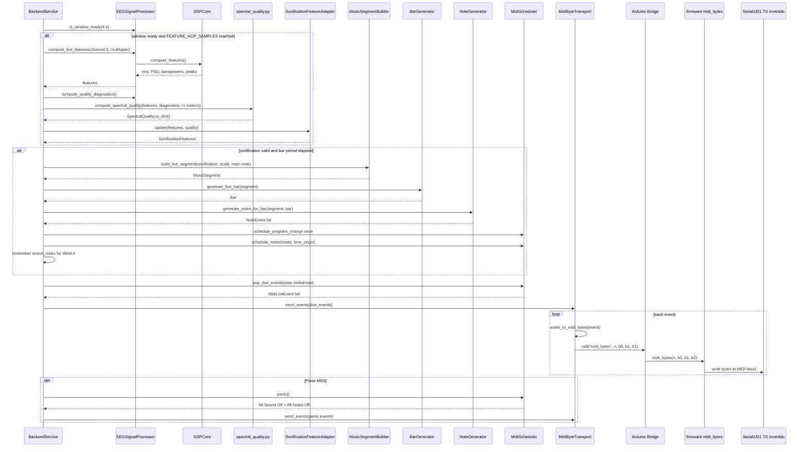

# 05. Diagrama de secuencia de sonificacion y MIDI

## Objetivo del diagrama

Mostrar como una ventana EEG con features validas se convierte en notas MIDI y salida fisica.

## Que incluye

- Feature hop.
- DSP live y quality gate.
- Adaptacion de controles de sonificacion.
- Segmento, compas y notas.
- Scheduler MIDI, transporte y `midi_bytes`.
- Panic como ruta de seguridad.

## Que excluye

- Test loop MIDI diagnostico.
- LED matrix.
- Persistencia detallada de snapshot.
- Tools offline de validacion musical.

## Diagrama Mermaid

## Notas de correspondencia con archivos reales

- `FEATURE_WINDOW_SEC=4.0` y `FEATURE_HOP_SAMPLES=64` viven en `backend_service.py`.
- `MUSIC_BAR_SEC=2.0` controla la generacion de compases.
- `MIDI_LOOKAHEAD_SEC=0.02` se usa al extraer eventos vencidos.
- `MidiByteTransport` no genera musica; solo convierte `MidiLiveEvent` a bytes y llama `midi_bytes`.
- El firmware conserva la responsabilidad de escribir por UART fisica.

## Advertencias de simplificacion

El quality gate no modifica adquisicion ni DSP; actua entre features y controles de sonificacion. El panic MIDI debe conservarse aunque se simplifique el resto del relato.
