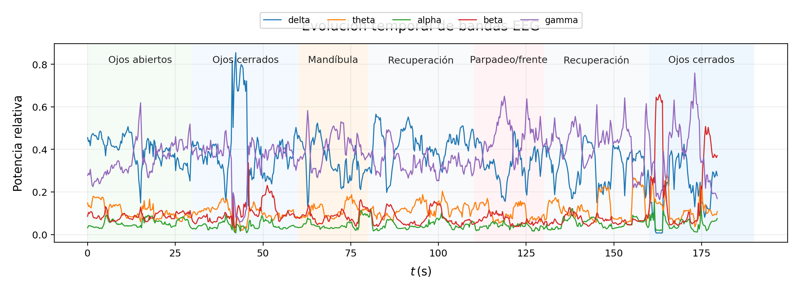

# 00. Resumen general de validación

Generado automáticamente por `python/tools/build_validation_docs.py`.

La validación se realizó antes de diseñar la sonificación final para separar tres problemas: la adquisición física de la señal, la extracción espectral de características y la respuesta musical. Esta separación evita atribuir a la música errores que podrían venir del ADC, del firmware o del montaje de electrodos.

En la rama documentada se dispone de 14 capturas versionadas con informes asociados. Las pruebas internas y reales indican que la cadena ADS1299 -> SPI -> firmware -> Bridge -> Python funciona sin pérdidas temporales apreciables en las capturas principales. Las limitaciones restantes se asocian sobre todo a artefactos biológicos o mecánicos: mandíbula, frente, contacto de electrodos, movimiento de cables y ruido común.

La captura final `20260524-122200_final_atenuacion_artefactos_mixed_states` resume el estado alcanzado: fs=250.0 Hz, gaps=0, invalid_status=0, RMS mediano por ventanas=83.30 µV y quality score mediano=0.912.

| Bloque validado | Pruebas realizadas | Resultado | Estado final |
| --- | --- | --- | --- |
| ADS1299/SPI/RDATAC | ID 0x3C, status 0xC00000, shorted_inputs | sin gaps/invalid status en capturas versionadas | razonablemente validado |
| Bridge MCU-Python | capturas CSV con 250 Hz y bloques de 8 | streaming estable | validado en condiciones probadas |
| Montaje electrodos | Fp1-Fp2, ear-EEG, BIAS/RLD | ear-EEG y CH1-only más estables | montaje final definido |
| DSP multitaper | windowed PSD, bandpowers, quality score | features reproducibles offline | validado para diagnóstico |
| Sonificación | quality gate y controles espectrales | atenuación funciona; diseño musical pendiente | siguiente fase |

Queda fuera del alcance de estos documentos el diseño sonoro definitivo. La evidencia aquí recogida sirve como base para esa fase posterior.

## Captura final válida y evolución temporal

La captura `20260524-122200_final_atenuacion_artefactos_mixed_states` se usa como evidencia final de la fase de adquisición/DSP con atenuación de artefactos. La línea temporal mostrada en las figuras procede del protocolo de captura usado en la placa: ojos abiertos, ojos cerrados, mandíbula, recuperación, parpadeo/frente, recuperación y ojos cerrados. Como los estados no están embebidos muestra a muestra en `metadata.json`, se documentan como timeline asumida desde el protocolo ejecutado.

| Métrica | Valor | Interpretación |
| --- | --- | --- |
| Duración | 191.7 s | captura larga suficiente para observar estados y transitorios |
| Frecuencia efectiva | 250.0 Hz | coincide con el objetivo de adquisición |
| Muestras | 45872 | stream completo de la sesión |
| Sample gaps | 0 | sin discontinuidades temporales detectadas |
| Invalid status | 0 | sin errores de estado ADS1299 |
| RMS global | 848.7 µV | afectado por transitorios de artefacto |
| RMS mediano por ventana | 83.30 µV | representa mejor los tramos estables |
| RMS p95 | 264.2 µV | cuantifica ventanas altas |
| Best window RMS | 44.90 µV | referencia de tramo limpio |
| PTP global | 98868 µV | detecta artefactos extremos |
| PTP mediano | 1200 µV | amplitud típica por ventana |
| PTP p95 | 1763 µV | transitorios altos |
| Ratio 50 Hz | 0.003 | ruido de red no dominante globalmente |
| Artifact windows | 6.0% | ventanas artefactadas según quality_report |
| Spectral quality mediana | 0.912 | score offline/live comparable |
| Low-quality spectral | pendiente | ventanas atenuadas o bloqueadas |
| Diagnóstico | valida_preliminar_con_artefactos | resultado automático del análisis |

Tabla de inventario: [`tables/table_01_capture_summary.csv`](tables/table_01_capture_summary.csv).
Inventario all-branches: [`tables/table_00_capture_inventory_all_branches.csv`](tables/table_00_capture_inventory_all_branches.csv).

La evolución de ramas, commits y decisiones de esta conversación se documenta en [`08_historial_ramas_y_cambios.md`](08_historial_ramas_y_cambios.md).
