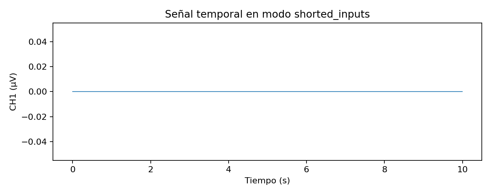
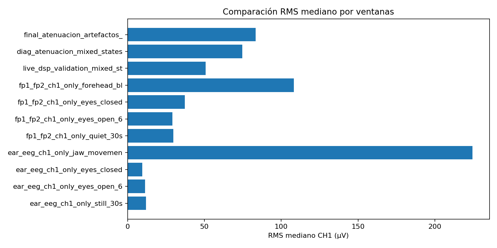
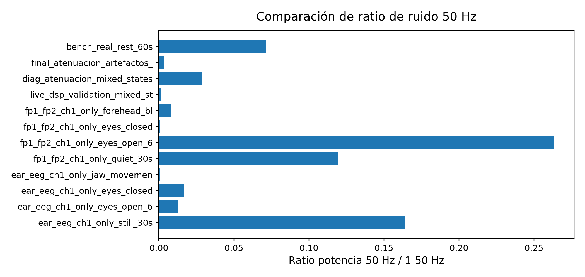

# 01. Validacion de captura de datos ADS1299 - final-v4

## 1. Objetivo

Este documento valida la parte baja de adquisicion de datos:

```text
ADS1299 -> SPI/RDATAC -> firmware MCU -> Bridge.notify("eeg_block_uV") -> Python -> CSV
```

Su objetivo no es demostrar EEG fisiologicamente limpio, sino confirmar que la cadena digital de adquisicion y transporte funciona sin discontinuidades relevantes antes de interpretar calidad de senal, DSP o sonificacion.

El documento original fue generado por `python/tools/build_validation_docs.py`. En final-v4 se mantiene como evidencia de diseno y se interpreta junto a:

```text
09_benchmarks_rendimiento_placa.md
10_resultados_captura_final_laboratorio.md
```

## 2. Arquitectura validada

```text
Electrodos / modo diagnostico
   ↓
ADS1299-4PAG
   ↓ SPI / DRDY / RDATAC
Arduino UNO Q MCU
   ↓ filtros MCU + bloques de 8 muestras
Bridge.notify("eeg_block_uV")
   ↓
Python backend
   ↓
CSV / DSP / WebUI / tools offline
```

El firmware reconstruye frames RDATAC de 24 bits, valida el prefijo de estado `0xC00000`, convierte cuentas a voltios mediante el LSB configurado y envia bloques `eeg_block_uV` de 8 muestras. Los CSV analizados contienen la senal en microvoltios.

## 3. Configuracion final-v4 relacionada

| Parametro | Valor |
| --- | --- |
| Variante esperada | ADS1299-4PAG / 4 canales |
| Frecuencia | 250 Hz |
| Contrato Bridge | `eeg_block_uV` |
| Bloque | 8 muestras |
| Status valido | `(status & 0xF00000) == 0xC00000` |
| Modo final de capturas | `ADS_DIAGNOSTIC_MODE=5 / bias_ch1_only_loff_off` |
| Canal principal final | CH1 |
| CH2-CH4 | Conservados por contrato, no EEG activo en final-v4 |

## 4. Prueba diagnostica de ADC/ruta digital

La prueba interna `20260523-175959_post_configfix_shorted_inputs` se empleo para aislar el ADC y la ruta digital de los electrodos. Su diagnostico fue `valida_diagnostica`, con:

| Metrica | Valor | Lectura |
| --- | ---: | --- |
| fs | 250.0 Hz | Coincide con el objetivo. |
| gaps | 0 | Sin discontinuidades temporales. |
| invalid_status | 0 | Status ADS coherente. |
| RMS | 0.115 uV | Ruido interno bajo. |
| Pico-pico | 4.000 uV | Coherente con entrada cortocircuitada. |

Estos valores son coherentes con una cadena digital sana y ruido interno bajo.

Durante la auditoria se exploro la existencia de una captura versionada de `test_signal_internal`. No se localizo CSV completo en las ramas inspeccionadas; por tanto, se conserva como prueba descrita durante el desarrollo, pero pendiente de incorporar si se desea trazabilidad completa mediante `eeg_timeseries.csv`, `metadata.json` y `quality_report.*`.

## 5. Figuras asociadas

Para esta seccion conviene usar una figura temporal y una comparacion general de ruido/status. La PSD del modo shorted inputs puede conservarse como artefacto generado, pero no es necesaria en el relato principal de captura ADS1299 porque la validacion de espectro se trata despues en los documentos `04` y `05`.

| Figura | Usar en texto principal | Papel |
| --- | --- | --- |
| `fig_01_shorted_inputs_timeseries.png` | Si | Evidencia visual de ruido bajo con entradas cortocircuitadas. |
| `fig_04_rms_comparison.png` | Si | Comparacion global de RMS entre capturas/montajes. |
| `fig_06_50hz_comparison.png` | Si | Comparacion global de componente de red. |
| `fig_02_shorted_inputs_psd.png` | No principal | Figura auxiliar; mover a DSP/espectro si se necesita. |







Si se quieren regenerar con mejor margen/titulo:

```bash
python3 python/tools/build_validation_docs_final_v4_style.py --captures captures --output docs/validacion_tfg
```

## 6. Tablas

- Tabla resumen: [`tables/table_03_ads1299_validation_summary.csv`](tables/table_03_ads1299_validation_summary.csv).
- Inventario all-branches: [`tables/table_00_capture_inventory_all_branches.csv`](tables/table_00_capture_inventory_all_branches.csv).

## 7. Conclusion

Bajo las capturas versionadas, la ruta ADC/SPI/Bridge/Python queda razonablemente validada. Los problemas observados en capturas reales posteriores no se explican por gaps, status invalido persistente ni fallo de streaming, sino por montaje bioelectrico, ruido comun, artefactos y calidad de contacto.
