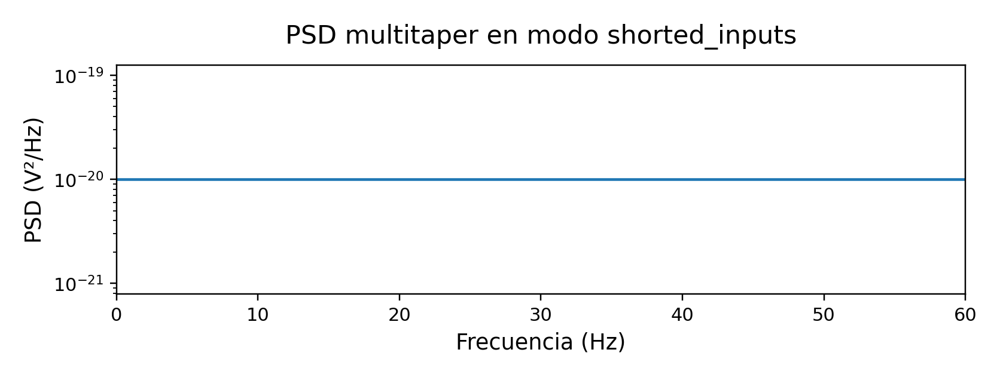

# 01. Validación de captura de datos ADS1299

Generado automáticamente por `python/tools/build_validation_docs.py`.

La arquitectura de adquisición validada es:

```text
Electrodos
   ↓
ADS1299-4PAG
   ↓
SPI / DRDY / RDATAC
   ↓
Arduino UNO Q MCU
   ↓
Bridge
   ↓
Python backend
   ↓
CSV / DSP / UI
```

El firmware reconstruye frames RDATAC de 24 bits, valida el prefijo de estado `0xC00000`, convierte cuentas a voltios mediante el LSB configurado y envía bloques `eeg_block_uV` de 8 muestras. Los CSV analizados contienen la señal ya en microvoltios.

La prueba interna `20260523-175959_post_configfix_shorted_inputs` se empleó para aislar el ADC y la ruta digital de los electrodos. Su diagnóstico fue `valida_diagnostica`, con fs=250.0 Hz, gaps=0, invalid_status=0, RMS=0.115 µV y pico-pico=4.000 µV. Estos valores son coherentes con una cadena digital sana y ruido interno bajo.

Durante esta actualización se exploraron las ramas locales y remotas disponibles mediante `git branch -a` y `git ls-tree`. No se localizó un CSV versionado de `test_signal_internal` en las ramas inspeccionadas; por tanto, se conserva como prueba realizada durante la conversación, pero pendiente de incorporar si se desea trazabilidad completa mediante `eeg_timeseries.csv`, `metadata.json` y `quality_report.*`.





Tabla resumen: [`tables/table_03_ads1299_validation_summary.csv`](tables/table_03_ads1299_validation_summary.csv).
Inventario all-branches: [`tables/table_00_capture_inventory_all_branches.csv`](tables/table_00_capture_inventory_all_branches.csv).

Conclusión: bajo las capturas versionadas, la ruta ADC/SPI/Bridge/Python queda razonablemente validada; los problemas posteriores no se explican por gaps, status inválido ni fallo de streaming.
