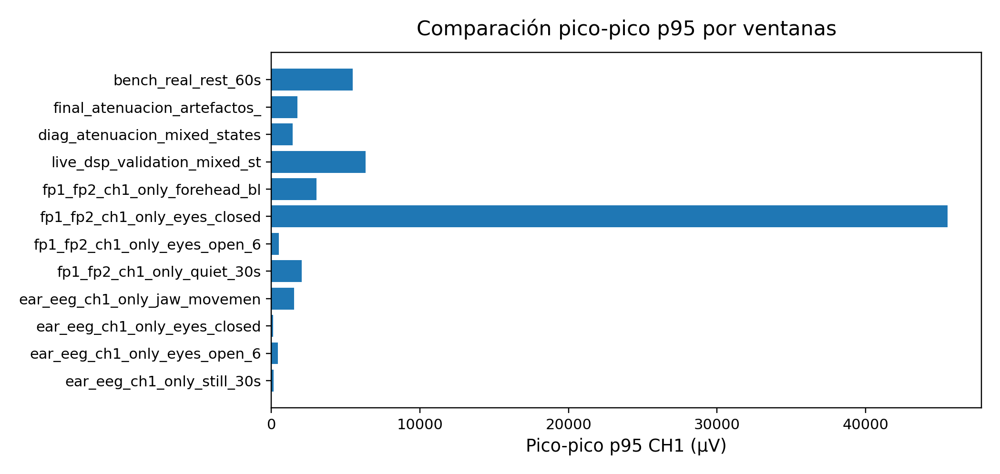

# 02. Validación del montaje de electrodos, BIAS y RLD

Generado automáticamente por `python/tools/build_validation_docs.py`.

El montaje inicial Fp1-Fp2 permitió observar actividad frontal, pero mostró sensibilidad a contacto, movimiento y ruido común. La activación de BIAS/RLD y el paso a modos `bias_ch1pn_loff_off` y posteriormente `bias_ch1_only_loff_off` redujeron la influencia de canales no usados y facilitaron capturas más estables.

La evidencia versionada muestra dos familias útiles: Fp1-Fp2, más expresiva frente a parpadeo/frente pero menos robusta, y ear-EEG/mastoides, más estable para validación de reposo y cambios de estado. El montaje final de diagnóstico usa CH1 activo, BIAS derivado de CH1P+CH1N y lead-off desactivado.

| Montaje | Configuración física | Configuración ADS1299 | Objetivo | Resultado | Decisión |
| --- | --- | --- | --- | --- | --- |
| Shorted inputs | entradas cortocircuitadas internamente | MUX=SHORT | aislar ADC/SPI/escala | ruido interno bajo | mantener como prueba diagnóstica |
| Test interno ADS1299 | sin electrodos | señal interna ADS1299 | verificar ruta de escala/frecuencia | CSV no localizado en ramas | pendiente de incorporar |
| Fp1-Fp2 sin BIAS/RLD | frontal Fp1-Fp2 | BIAS desactivado | prueba inicial real | amplitudes altas y común inestable | descartado como montaje final |
| Fp1-Fp2 con BIAS/RLD | frontal con electrodo RLD | BIAS CH1P+CH1N | reducir común | mejora pero sensible a frente/parpadeo | útil para artefactos frontales |
| RLD mastoide izquierda/derecha | RLD detrás de oreja | BIAS activo | comparar posición de referencia | variabilidad entre pruebas | no elegido como único montaje |
| RLD muñeca/antebrazo | RLD distal | BIAS activo | estabilizar común corporal | buenas ventanas en ear-EEG | opción práctica |
| Ear-EEG/mastoides | IN1P/IN1N en mastoides/oreja | CH1-only, CH2-CH4 apagados | buscar señal estable | capturas más robustas | montaje final de validación |
| Mandíbula/frente | gestos controlados | CH1-only | provocar artefactos | quality gate detecta ventanas malas | usar para validar rechazo |

Comparación de montajes: [`tables/table_02_mounting_comparison.csv`](tables/table_02_mounting_comparison.csv).

Conclusión: el montaje final no elimina los artefactos biológicos, pero ofrece una base suficientemente estable para analizar ventanas limpias. La elección se justifica por estabilidad temporal, ausencia de gaps y respuesta clara ante artefactos controlados.
