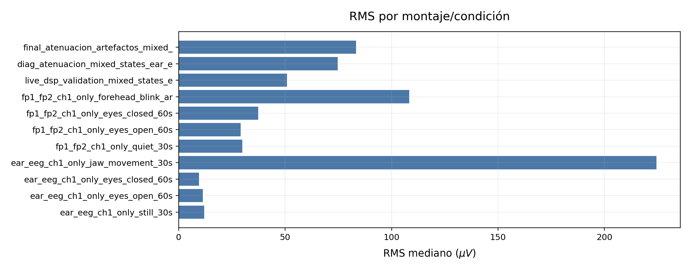
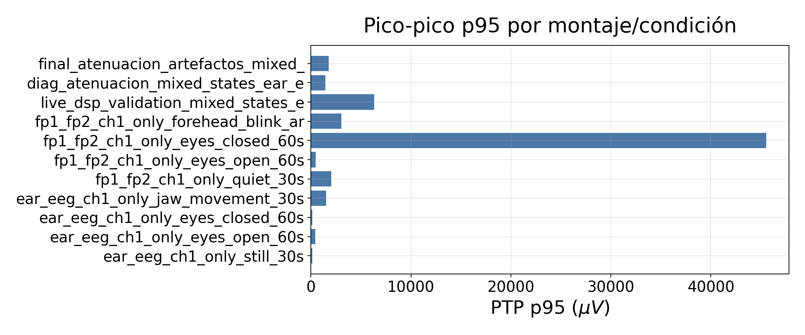
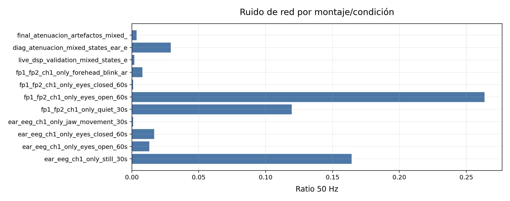
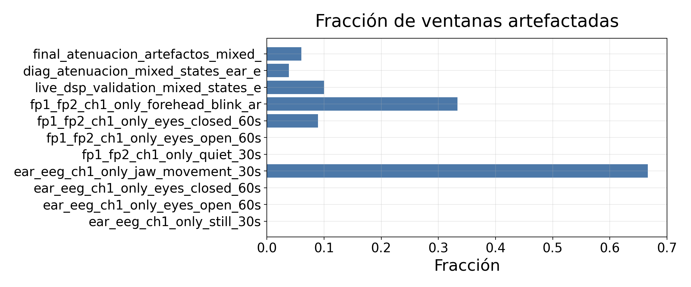
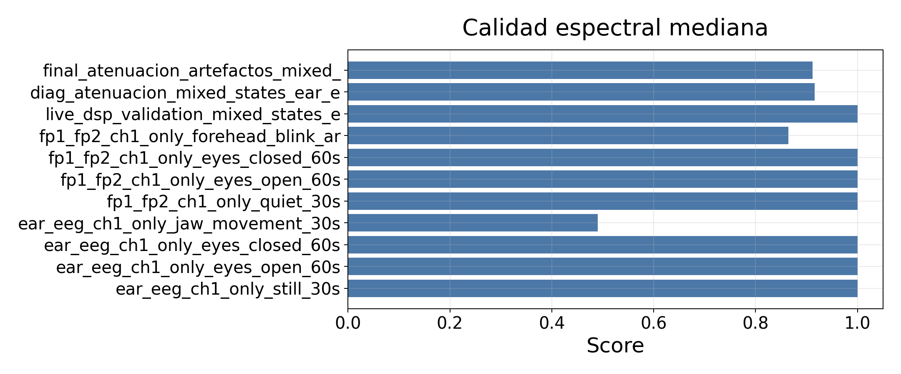

# 02. Validacion del montaje de electrodos, BIAS y RLD - final-v4

## 1. Objetivo

Este documento justifica la decision de montaje bioelectrico usada en final-v4. La validacion compara pruebas frontales, pruebas ear-EEG/mastoides, uso de BIAS/RLD y modos ADS1299.

La conclusion final no es que el montaje elimine todos los artefactos, sino que ofrece una base mas estable para adquirir ventanas utiles y aplicar quality gate.

## 2. Evolucion de montaje

El montaje inicial Fp1-Fp2 permitio observar actividad frontal y artefactos claros de parpadeo/frente, pero mostro sensibilidad a contacto, movimiento y ruido comun.

La activacion de BIAS/RLD y el paso a modos:

```text
bias_ch1pn_loff_off
bias_ch1_only_loff_off
```

redujeron la influencia de canales no usados y facilitaron capturas mas estables.

La configuracion final-v4 queda fijada como:

```text
ADS_DIAGNOSTIC_MODE=5
ADS_MODE=bias_ch1_only_loff_off
montage=ear_eeg_ch1_only
CH1 activo
BIAS derivado de CH1P + CH1N
lead-off desactivado
CH2-CH4 apagados/conservados por contrato
```

## 3. Comparacion de montajes

| Montaje | Configuracion fisica | Configuracion ADS1299 | Objetivo | Resultado | Decision |
| --- | --- | --- | --- | --- | --- |
| Shorted inputs | entradas cortocircuitadas internamente | MUX=SHORT | aislar ADC/SPI/escala | ruido interno bajo | mantener como prueba diagnostica |
| Test interno ADS1299 | sin electrodos | senal interna ADS1299 | verificar ruta de escala/frecuencia | CSV no localizado en ramas | pendiente de incorporar si se desea trazabilidad completa |
| Fp1-Fp2 sin BIAS/RLD | frontal Fp1-Fp2 | BIAS desactivado | prueba inicial real | amplitudes altas y comun inestable | descartado como montaje final |
| Fp1-Fp2 con BIAS/RLD | frontal con electrodo RLD | BIAS CH1P+CH1N | reducir comun | mejora pero sensible a frente/parpadeo | util para artefactos frontales |
| RLD mastoide izquierda/derecha | RLD detras de oreja | BIAS activo | comparar posicion de referencia | variabilidad entre pruebas | no elegido como unico montaje |
| RLD muneca/antebrazo | RLD distal | BIAS activo | estabilizar comun corporal | buenas ventanas en ear-EEG | opcion practica |
| Ear-EEG/mastoides | IN1P/IN1N en mastoides/oreja | CH1-only, CH2-CH4 apagados | buscar senal estable | capturas mas robustas | montaje final de validacion |
| Mandibula/frente | gestos controlados | CH1-only | provocar artefactos | quality gate detecta ventanas malas | usar para validar rechazo |

## 4. Lectura de las figuras

Para evitar duplicados, esta seccion debe usar solo las figuras nuevas especificas de montaje (`fig_02_mounting_*`). Las comparaciones generales `fig_04_rms_comparison`, `fig_05_ptp_comparison` y `fig_06_50hz_comparison` se conservan como figuras generadas, pero no se insertan aqui porque mezclan mas capturas y ya aparecen en otros documentos.

Orden recomendado:

| Orden | Figura | Pregunta que responde |
| --- | --- | --- |
| 1 | `fig_02_mounting_rms_comparison.png` | Que montaje/condicion presenta menor amplitud RMS mediana. |
| 2 | `fig_02_mounting_ptp_comparison.png` | Que montaje/condicion presenta mayores transitorios pico-pico. |
| 3 | `fig_02_mounting_50hz_comparison.png` | Que montaje/condicion esta mas afectado por red de 50 Hz. |
| 4 | `fig_02_mounting_artifact_fraction.png` | Que montaje/condicion acumula mas ventanas artefactadas. |
| 5 | `fig_02_mounting_quality_score.png` | Que montaje/condicion tiene mejor calidad espectral mediana. |











Para regenerar estas figuras con margenes/titulos final-v4:

```bash
python3 python/tools/build_validation_docs_final_v4_style.py --captures captures --output docs/validacion_tfg
```

## 5. Tabla asociada

Comparacion de montajes:

```text
tables/table_02_mounting_comparison.csv
```

## 6. Conclusion

El montaje final no elimina los artefactos biologicos, pero ofrece una base suficientemente estable para analizar ventanas limpias. La eleccion de `ear_eeg_ch1_only` con `bias_ch1_only_loff_off` se justifica por:

1. estabilidad temporal;
2. ausencia de gaps;
3. status ADS valido;
4. menor influencia de canales no usados;
5. respuesta clara ante artefactos controlados;
6. compatibilidad con quality gate y sonificacion final-v4.

