# 03. Validación de calidad de señal real

Generado automáticamente por `python/tools/build_validation_docs.py`.

La calidad de señal real se evaluó con métricas globales y por ventanas. Las métricas globales detectan artefactos grandes, mientras que las ventanas permiten distinguir una captura parcialmente válida de una captura completamente mala.

Criterios utilizados:

- señal válida: 250 Hz efectivo, sample gaps 0, invalid status 0, RMS mediano plausible y baja fracción de ventanas artefactadas;
- señal dudosa: transporte correcto pero RMS/PTP o 50 Hz altos en una parte relevante de la captura;
- señal no válida: gaps, status inválido persistente, saturación, flatline o artefactos dominantes que impiden extraer ventanas limpias.

En la captura final `20260524-122200_final_atenuacion_artefactos_mixed_states` se observó `valida_preliminar_con_artefactos`. El RMS global fue 848.7 µV, pero el RMS mediano por ventanas fue 83.30 µV, lo que indica que el valor global está influido por transitorios. La fracción de ventanas artefactadas fue 6.0% y la calidad espectral mediana fue 0.912.

La siguiente tabla usa la timeline asumida desde el protocolo ejecutado en la placa.

| Estado | RMS mediano | PTP mediano | 50 Hz | Calidad | Banda dominante | Diagnóstico |
| --- | --- | --- | --- | --- | --- | --- |
| Ojos abiertos | 76.76 | 1272 | 0.259 | 0.987 | delta | usable con artefactos leves |
| Ojos cerrados | 80.01 | 1226 | 0.268 | 0.922 | delta | artefactos moderados |
| Mandíbula | 69.72 | 1217 | 0.322 | 0.893 | gamma | usable con artefactos leves |
| Recuperación | 80.44 | 1275 | 0.226 | 1.000 | delta | estable |
| Parpadeo/frente | 94.22 | 1558 | 0.364 | 0.823 | gamma | usable con artefactos leves |
| Recuperación | 109.8 | 1701 | 0.346 | 0.856 | gamma | usable con artefactos leves |
| Ojos cerrados | 175.4 | 1725 | 0.188 | 0.621 | gamma | artefacto dominante |

Tabla CSV: [`tables/table_03_mixed_state_stats.csv`](tables/table_03_mixed_state_stats.csv).

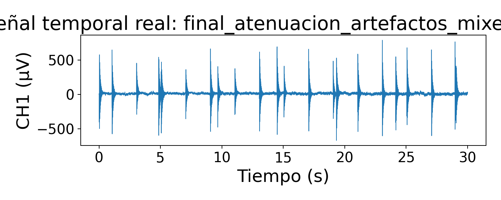

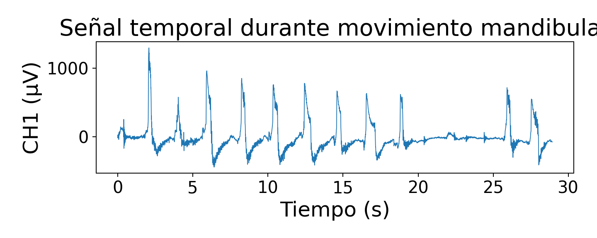

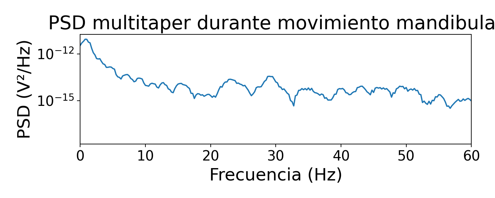

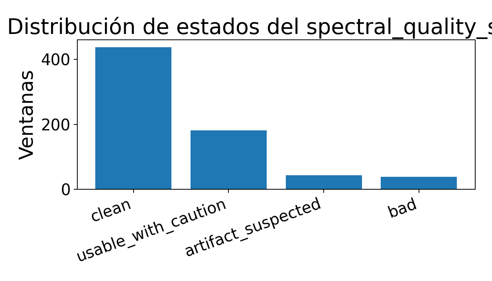

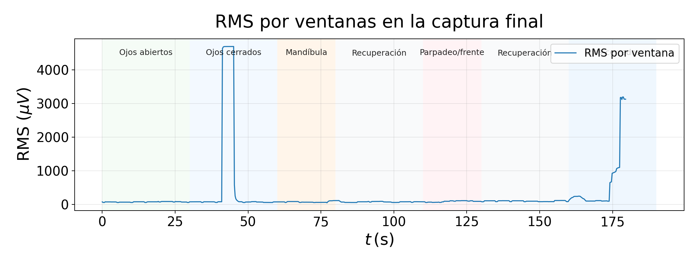

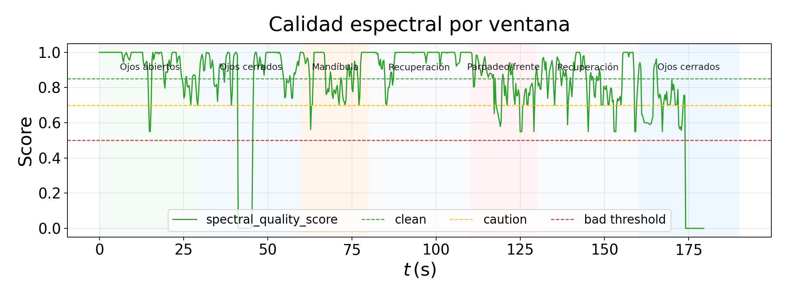

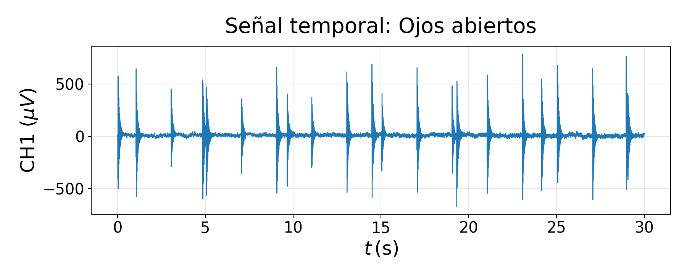

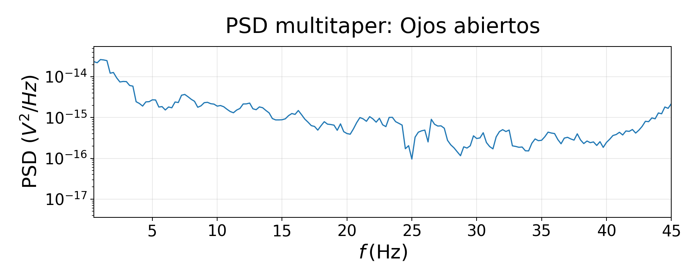

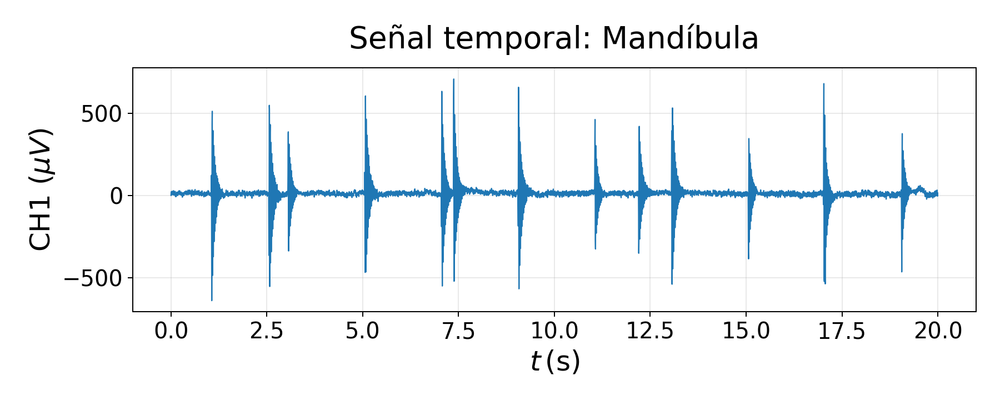

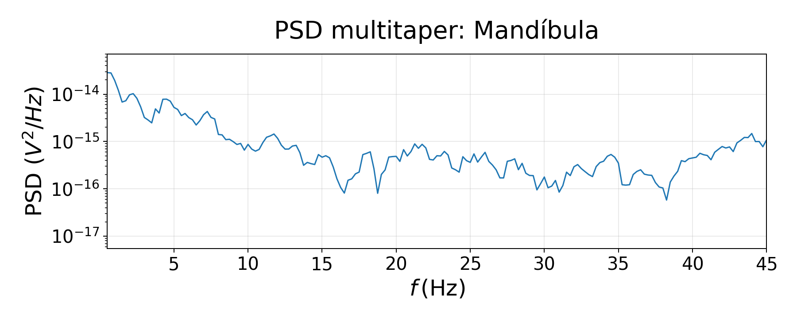

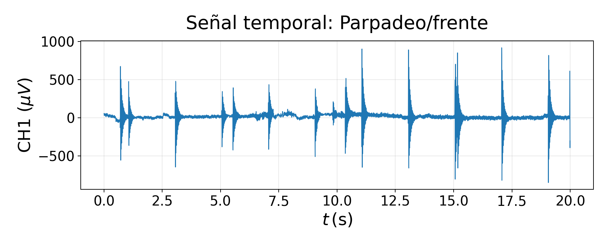

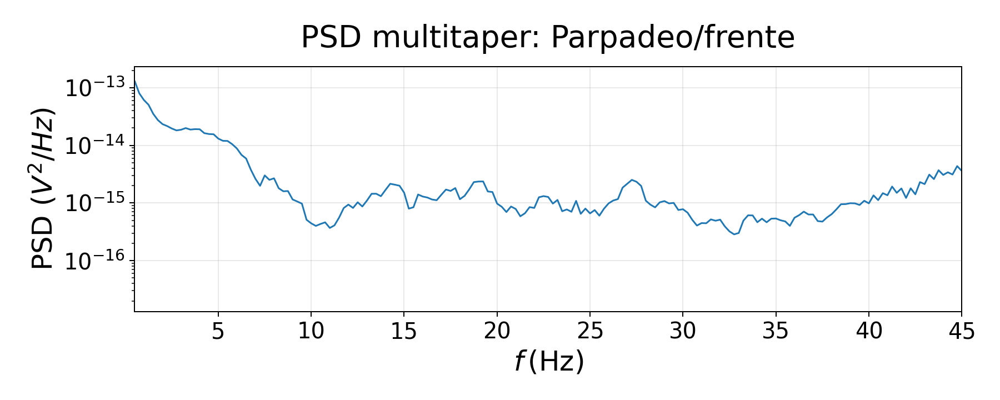

Inventario completo: [`tables/table_01_capture_summary.csv`](tables/table_01_capture_summary.csv).
