# 03. Validacion de calidad de senal real - final-v4

## 1. Objetivo

Este documento valida los criterios usados para decidir si una captura real contiene ventanas utiles o si esta dominada por artefactos. Su papel es justificar el uso de metricas de calidad y del `quality gate` antes de sonificar.

No debe leerse como validacion clinica EEG. La calidad se evalua para un sistema experimental de sonificacion:

```text
senal real -> diagnostico de calidad -> spectral_quality_score -> gate de sonificacion
```

## 2. Criterios utilizados

La calidad de senal real se evaluo con metricas globales y por ventanas. Las metricas globales detectan artefactos grandes, mientras que las ventanas permiten distinguir una captura parcialmente valida de una captura completamente mala.

Criterios:

- senal valida: 250 Hz efectivo, sample gaps 0, invalid status 0, RMS mediano plausible y baja fraccion de ventanas artefactadas;
- senal dudosa: transporte correcto pero RMS/PTP o 50 Hz altos en una parte relevante de la captura;
- senal no valida: gaps, status invalido persistente, saturacion, flatline o artefactos dominantes que impiden extraer ventanas limpias.

En final-v4, esta logica se materializa en:

```text
compute_quality_diagnostics()
  -> compute_spectral_quality()
  -> gate_factor / valid_for_sonification
```

## 3. Captura mixed_states

La captura `20260524-122200_final_atenuacion_artefactos_mixed_states` se conserva como validacion intermedia de quality gate y estados/artefactos. No es la captura final principal de resultados; la sesion final actual es `s01_20260528`.

Esta captura es importante porque el sujeto paso por varios estados durante una misma adquisicion. Eso permite evaluar si las metricas de calidad y las features cambian con el contexto:

```text
ojos abiertos -> ojos cerrados -> mandibula -> recuperacion -> parpadeo/frente -> recuperacion -> ojos cerrados
```

En esa captura intermedia se observo `valida_preliminar_con_artefactos`:

| Metrica | Valor | Lectura |
| --- | ---: | --- |
| RMS global | 848.7 uV | Afectado por transitorios. |
| RMS mediano por ventanas | 83.30 uV | Representa mejor tramos estables. |
| Artifact windows | 6.0 % | Parte de la captura queda atenuada/bloqueada. |
| Calidad espectral mediana | 0.912 | Quality score alto en muchas ventanas. |

## 4. Timeline asumida de estados

La siguiente tabla usa la timeline asumida desde el protocolo ejecutado en placa. Los estados no estaban embebidos muestra a muestra en `metadata.json`, por lo que esta division se usa como apoyo interpretativo, no como ground truth fisiologico absoluto.

| Estado | RMS mediano | PTP mediano | 50 Hz | Calidad | Banda dominante | Diagnostico |
| --- | ---: | ---: | ---: | ---: | --- | --- |
| Ojos abiertos | 76.76 | 1272 | 0.259 | 0.987 | delta | usable con artefactos leves |
| Ojos cerrados | 80.01 | 1226 | 0.268 | 0.922 | delta | artefactos moderados |
| Mandibula | 69.72 | 1217 | 0.322 | 0.893 | gamma | usable con artefactos leves |
| Recuperacion | 80.44 | 1275 | 0.226 | 1.000 | delta | estable |
| Parpadeo/frente | 94.22 | 1558 | 0.364 | 0.823 | gamma | usable con artefactos leves |
| Recuperacion | 109.8 | 1701 | 0.346 | 0.856 | gamma | usable con artefactos leves |
| Ojos cerrados | 175.4 | 1725 | 0.188 | 0.621 | gamma | artefacto dominante |

Tabla CSV:

```text
tables/table_03_mixed_state_stats.csv
```

## 5. Orden correcto de figuras

Las figuras deben leerse en tres niveles. Las figuras antiguas especificas de mandibula (`fig_09_jaw_movement_timeseries` y `fig_10_jaw_emg_psd`) se conservan como artefactos generados, pero no deben ser el centro del relato porque rompen la comparacion homogenea entre estados.

### 5.1 Vista global de la captura

Primero se muestra la captura completa y la evolucion de calidad:


### 5.2 Estudio homogeneo por estado

Despues se estudia cada estado con el mismo par de figuras:

```text
senal temporal del estado
PSD multitaper del estado
```

#### Ojos abiertos / reposo

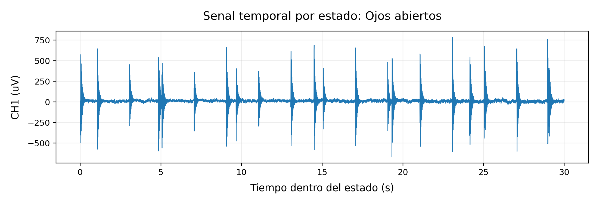

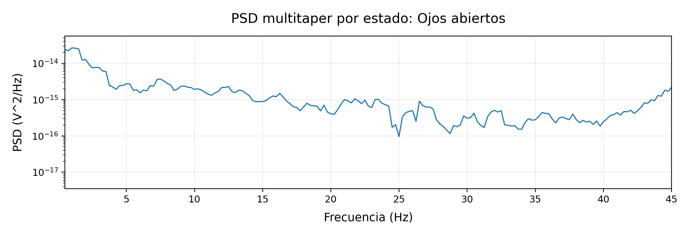

#### Ojos cerrados / reposo 1

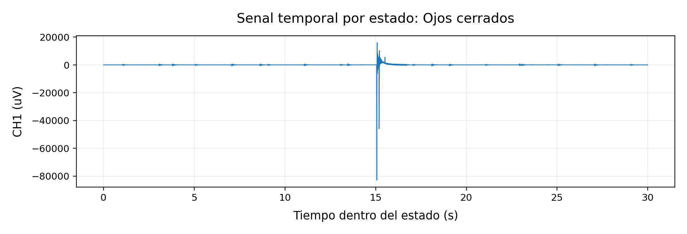

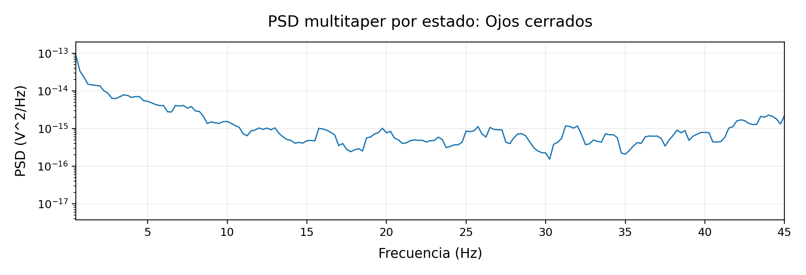

#### Mandibula

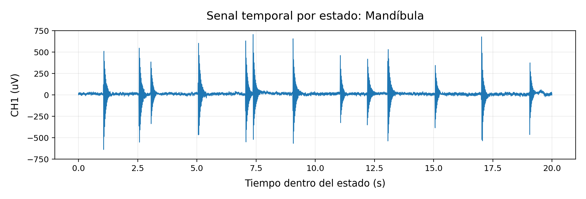

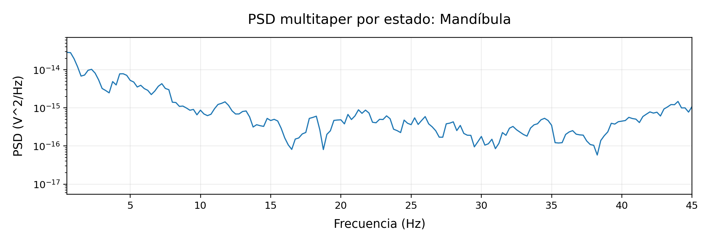

#### Recuperacion 1

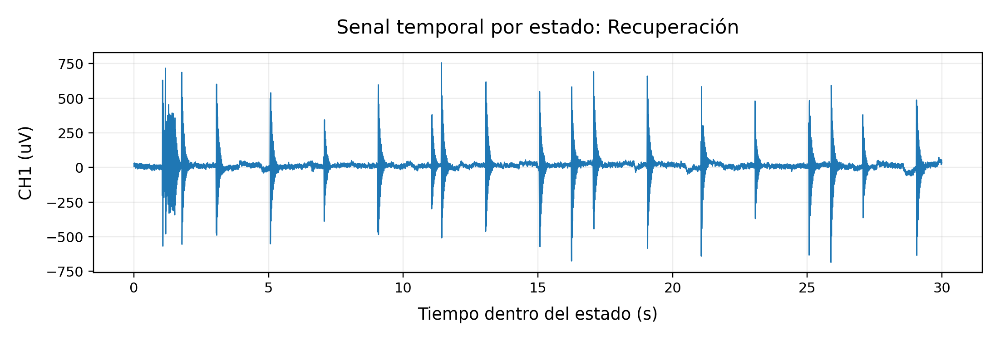

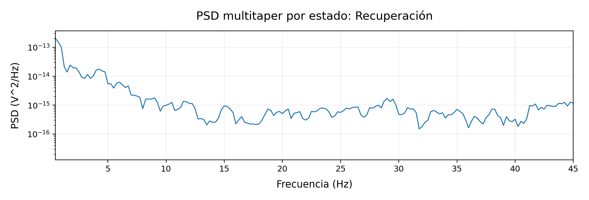

#### Parpadeo / frente

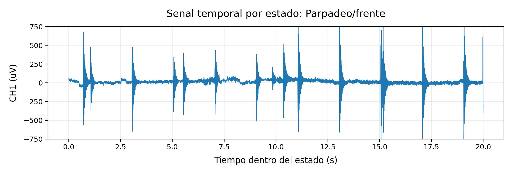

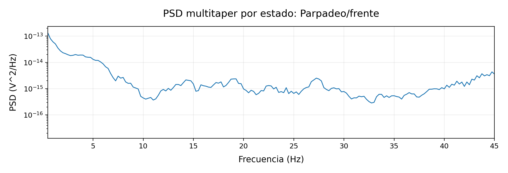

#### Recuperacion 2

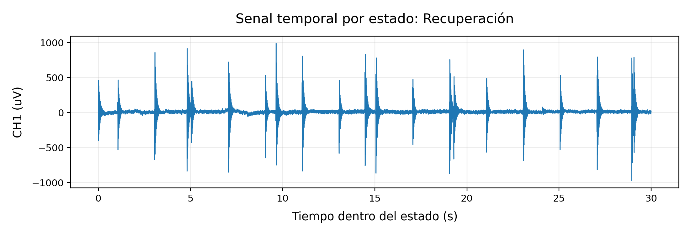

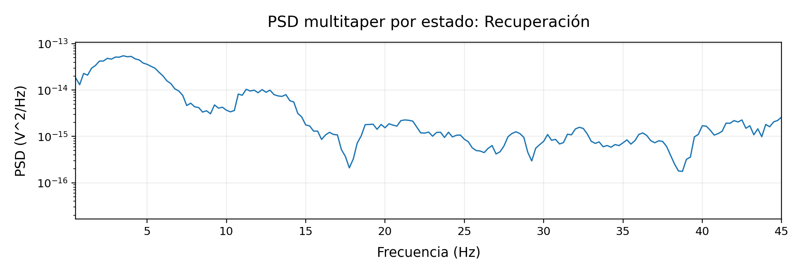

#### Ojos cerrados / reposo 2

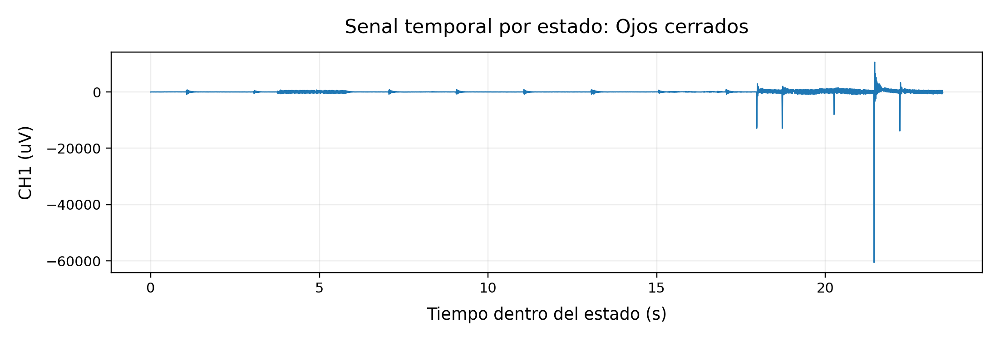

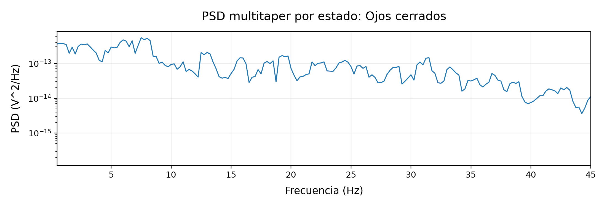

### 5.3 Comparacion DSP por estado

La comparacion periodograma vs multitaper se trata en el documento `04`, usando los mismos estados para mantener simetria metodologica.

Para regenerar solo figuras con nombres homogeneos:

```bash
python3 python/tools/build_validation_docs_final_v4_style.py --captures captures --output docs/validacion_tfg
```

El wrapper fuerza `--only-figures` por defecto para no sobrescribir estos Markdown revisados.

## 6. Relacion con la sesion final

La sesion `s01_20260528` confirma la misma lectura general: adquisicion temporalmente estable, pero calidad fisiologica parcial por ruido, transitorios y artefactos. Por eso, en la memoria conviene distinguir:

```text
validez tecnica de integracion = alta
validez fisiologica como EEG limpio = parcial
```

## 7. Conclusion

El sistema dispone de metricas suficientes para no tratar todas las ventanas por igual. La calidad de senal debe evaluarse por ventanas y por estado, y el quality gate debe conservarse como parte esencial del pipeline final-v4.
