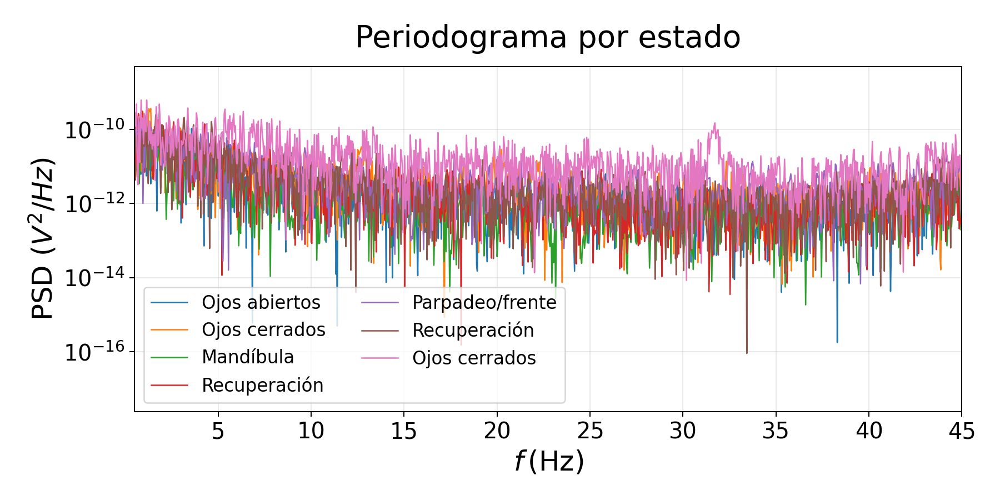
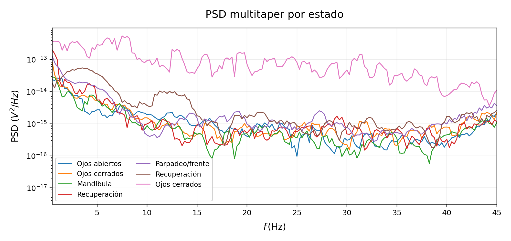
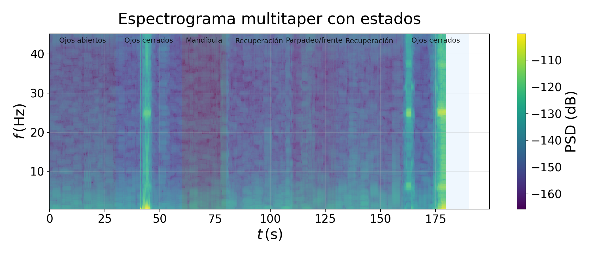
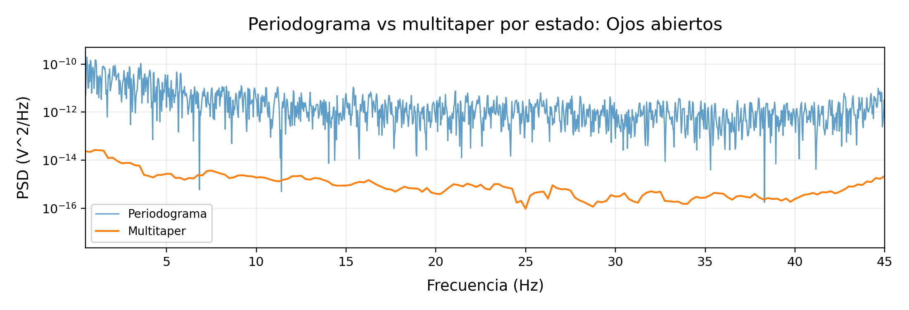
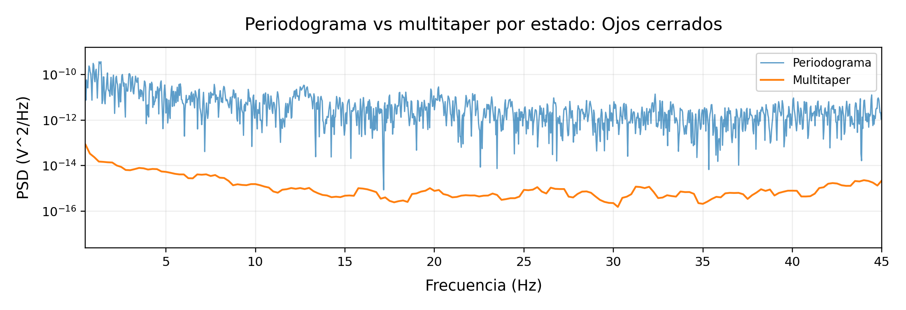
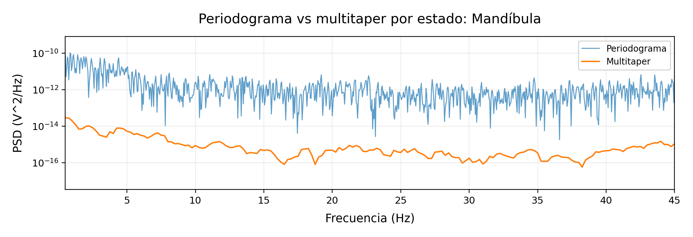
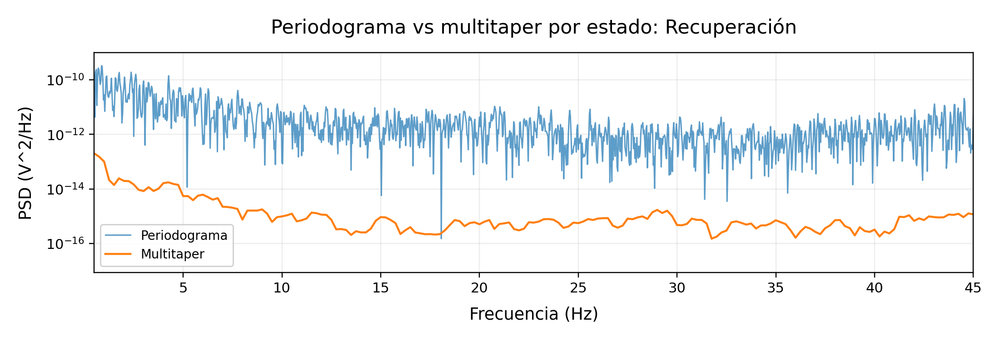
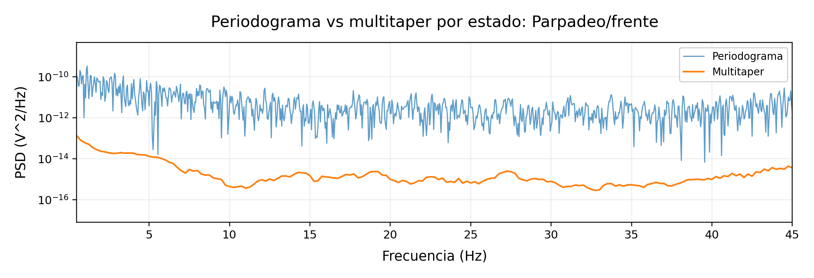
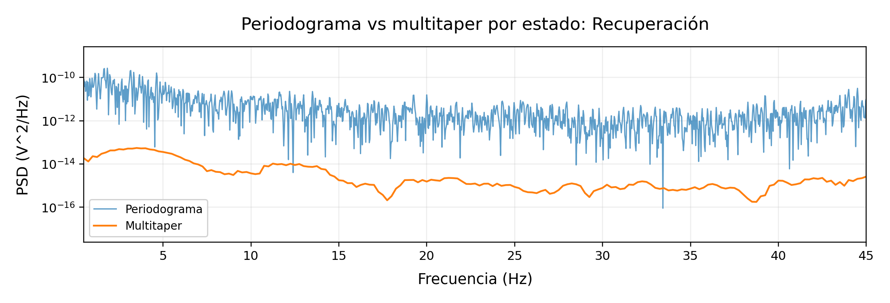
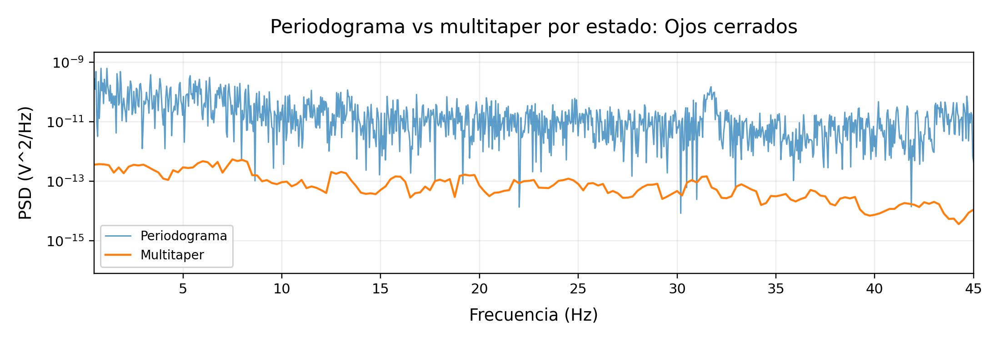

# 04. Validacion DSP y multitaper - final-v4

## 1. Objetivo

Este documento valida la decision de usar PSD multitaper para extraer bandpowers y features espectrales en ventanas EEG cortas. Su papel en el TFG es justificar el bloque DSP, no demostrar una interpretacion clinica completa.

Pipeline analizado:

```text
eeg_timeseries.csv / stream live
   ↓
ventana temporal CH1
   ↓
preprocesado ligero
   ↓
PSD multitaper
   ↓
bandpowers absolutos y relativos
   ↓
features espectrales
   ↓
quality gate / sonificacion
```

## 2. Configuracion final-v4

| Parametro | Valor |
| --- | --- |
| Frecuencia | 250 Hz |
| Canal principal | CH1 |
| Ventana | 4.0 s |
| Hop live | 64 muestras |
| Presupuesto temporal | 256 ms |
| Metodo PSD principal | multitaper |
| Bandas | delta, theta, alpha, beta, gamma |

Multitaper se mantiene porque reduce leakage y variabilidad de borde frente a un periodograma simple en ventanas EEG cortas. No sustituye al buen contacto de electrodos, no corrige saturacion y no separa por si solo EMG de EEG; por eso se anadio `spectral_quality_score`.

## 3. Captura intermedia usada para comparar metodos

La captura `20260524-122200_final_atenuacion_artefactos_mixed_states` se conserva como captura intermedia para comparar estados, periodograma, multitaper y quality gate. No sustituye a la sesion final `s01_20260528`, pero es util para justificar la decision DSP.

En esa captura, el informe espectral produjo una calidad mediana de 0.912. El valor de ventanas de baja calidad/artefacto queda documentado en los CSV/reportes asociados.

## 4. Lectura correcta de las figuras

La validacion DSP debe leerse en dos niveles:

1. Comparacion global de todos los estados en una misma figura.
2. Comparacion directa periodograma vs multitaper para cada estado individual.

### 4.1 Vista global

| Figura | Uso recomendado |
| --- | --- |
| `fig_08_windowed_bandpowers.png` | Evolucion de bandpowers relativos por ventana. |
| `fig_04_periodogram_by_state.png` | Periodograma superpuesto por estados. |
| `fig_04_multitaper_psd_by_state.png` | PSD multitaper superpuesta por estados. |
| `fig_04_spectrogram_with_state_bar.png` | Evolucion tiempo-frecuencia con estados. |








### 4.2 Periodograma vs multitaper por estado

Las siguientes figuras comparan ambos metodos sobre los mismos segmentos de la timeline. El objetivo es mostrar por estado que el periodograma conserva mas variabilidad, mientras que multitaper suaviza la estimacion y da bandpowers mas estables para sonificacion.

#### Ojos abiertos / reposo



#### Ojos cerrados / reposo 1



#### Mandibula



#### Recuperacion 1



#### Parpadeo / frente



#### Recuperacion 2



#### Ojos cerrados / reposo 2



Para regenerar solo figuras:

```bash
python3 python/tools/build_validation_docs_final_v4_style.py --captures captures --output docs/validacion_tfg
```

El wrapper fuerza `--only-figures` por defecto para no sobrescribir los Markdown revisados.

## 5. Interpretacion

Las figuras por estado comparan periodograma y multitaper sobre los mismos segmentos del protocolo. El periodograma conserva mas variabilidad y leakage; multitaper suaviza la estimacion al promediar tapers DPSS, lo que ayuda a obtener bandpowers mas estables para control musical.

El espectrograma resume la evolucion temporal y permite localizar artefactos o cambios de estado, pero no debe interpretarse como diagnostico clinico por si solo.

## 6. Relacion con final-v4

En final-v4, la ruta live benchmarkeada es:

```text
EEGSignalProcessor.compute_live_features()
  -> DSPCore.compute_features(method="multitaper")
```

La ruta secundaria `compute_online_features()` no debe usarse como ruta principal en UML ni memoria.

El resultado temporal de `09_benchmarks_rendimiento_placa.md` muestra que el coste de `compute_live_features()` queda muy por debajo del presupuesto de 256 ms por hop.

## 7. Conclusion

El DSP queda validado para extraccion de caracteristicas bajo ventanas limpias o controladas. Las ventanas artefactadas deben atenuarse o excluirse mediante quality gate. Para sonificacion, la combinacion recomendada es:

```text
multitaper + bandpowers relativos + suavizado + quality gate
```

