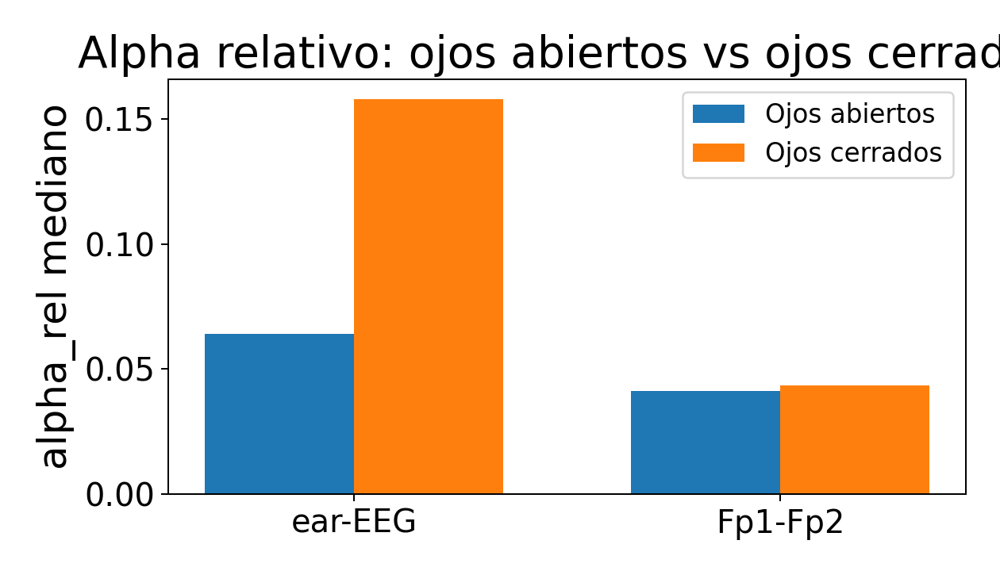
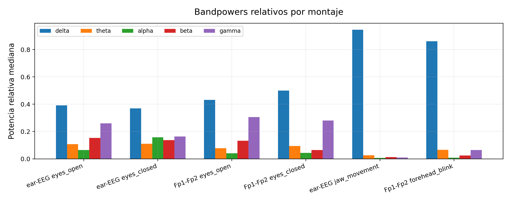
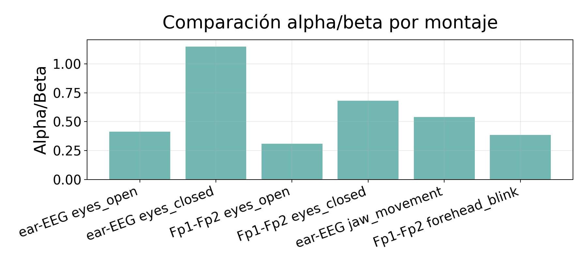
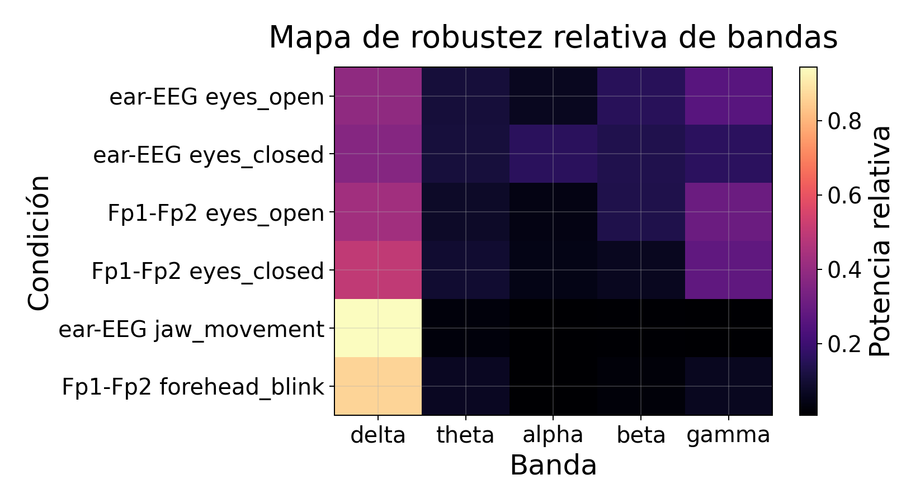
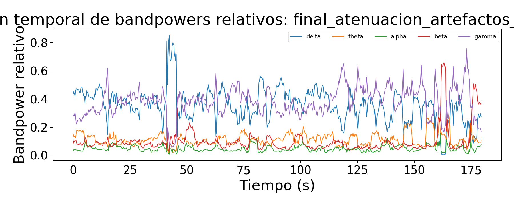

# 05. Validacion de bandas EEG y features espectrales - final-v4

## 1. Objetivo

Este documento justifica que las bandas EEG se usen como entrada de sonificacion y no como diagnostico clinico. La validacion distingue cuatro preguntas:

```text
1. Que bandas aparecen de forma medible.
2. Que bandas son mas robustas segun montaje y condicion.
3. Que bandas son mas sensibles a artefactos.
4. Como traducir esas bandas a controles musicales defendibles.
```

En final-v4, las bandas alimentan controles de sonificacion reportables y siempre deben interpretarse junto al quality gate.

## 2. Idea de diseno

La decision de diseno no consiste en decir que una banda aislada representa de forma directa un estado mental. La decision defendible para el TFG es usar patrones espectrales relativos como moduladores musicales:

```text
bandpowers relativos + RMS + picos espectrales + quality gate
  -> controles normalizados de sonificacion
```

Esto permite que el sistema sea expresivo musicalmente sin presentar la salida como diagnostico neurologico.

## 3. Comparacion de montajes y condiciones

La comparacion ojos abiertos/cerrados fue mas favorable en ear-EEG que en Fp1-Fp2. En Fp1-Fp2, la alfa clasica puede no aparecer de forma robusta por tratarse de un montaje frontal, con mayor contribucion ocular y muscular.

Capturas usadas en la validacion de diseno:

```text
ear-EEG:
20260523-200925_ear_eeg_ch1_only_eyes_open_60s
20260523-201055_ear_eeg_ch1_only_eyes_closed_60s

Fp1-Fp2:
20260523-202208_fp1_fp2_ch1_only_eyes_open_60s
20260523-202323_fp1_fp2_ch1_only_eyes_closed_60s
```

Estas capturas son antecedentes de diseno. La sesion final reportable es `s01_20260528`.

## 4. Resultados resumidos

| Montaje | Condicion | Delta | Theta | Alpha | Beta | Gamma | Alpha/Beta | Calidad | Lectura |
| --- | --- | ---: | ---: | ---: | ---: | ---: | ---: | ---: | --- |
| ear-EEG | eyes_open | 0.391 | 0.108 | 0.064 | 0.154 | 0.260 | 0.414 | 1.000 | Reposo con alpha limitada y beta/gamma moderadas. |
| ear-EEG | eyes_closed | 0.369 | 0.110 | 0.158 | 0.137 | 0.163 | 1.150 | 1.000 | Aumento relativo de alpha frente a ojos abiertos. |
| Fp1-Fp2 | eyes_open | 0.432 | 0.078 | 0.041 | 0.133 | 0.306 | 0.310 | 1.000 | Montaje mas expuesto a frente/actividad rapida. |
| Fp1-Fp2 | eyes_closed | 0.499 | 0.094 | 0.044 | 0.064 | 0.281 | 0.680 | 1.000 | Alpha no aparece de forma robusta en montaje frontal. |
| ear-EEG | jaw_movement | 0.945 | 0.026 | 0.007 | 0.012 | 0.010 | 0.541 | 0.490 | Condicion de artefacto; usar para rechazo/gate. |
| Fp1-Fp2 | forehead_blink | 0.861 | 0.066 | 0.009 | 0.024 | 0.064 | 0.386 | 0.864 | Condicion de artefacto frontal/parpadeo. |

Tabla CSV completa:

```text
tables/table_05_band_stats_fp1fp2_vs_eareeg.csv
```

## 5. Decisiones por banda

| Banda | Decision final-v4 | Cautela |
| --- | --- | --- |
| Delta | Apoyo contextual y estabilidad lenta. | Sensible a drift, movimiento y transitorios. |
| Theta | Apoyo contextual. | No sobreinterpretar sin mas sujetos/condiciones. |
| Alpha | Banda mas defendible para reposo relativo, especialmente en ear-EEG. | En Fp1-Fp2 no aparece robusta por montaje frontal. |
| Beta | Apoyo para actividad/tension y control musical. | Riesgo de EMG y movimiento. |
| Gamma | No usar como indicador fisiologico directo. | Muy sensible a EMG; usar solo como componente de tension/artefacto con gate. |

## 6. Traduccion a controles final-v4

Los nombres reportables actuales conectan cada control con su origen EEG/features:

| Control final-v4 | Relacion con bandas/features | Uso musical |
| --- | --- | --- |
| `alpha_drive` | Alpha relativa y relacion de reposo espectral. | Estabilidad/reposo relativo. |
| `beta_gamma_drive` | Beta/gamma relativas con cautela por EMG. | Tension armonica o sincopa. |
| `rms_beta_activity` | RMS normalizado + bandas rapidas. | Actividad global y dinamica. |
| `band_driven_density` | Actividad + tension espectral. | Densidad ritmica. |
| `spectral_register` | Pico/frecuencia dominante normalizada. | Registro melodico. |
| `alpha_stability` | Alpha frente a tension rapida. | Estabilidad armonica. |
| `rms_band_velocity` | RMS y bandas. | Intensidad/velocity MIDI. |
| `band_note_probability` | Densidad y bandas. | Probabilidad de nota. |

Los nombres antiguos (`activity`, `calmness`, `tension`, etc.) se consideran aliases legacy internos y no deben usarse como nombres principales del TFG.

## 7. Orden recomendado de figuras

Las figuras de esta seccion ya son bastante utiles. El orden recomendado es:

| Orden | Figura | Que explica |
| --- | --- | --- |
| 1 | `fig_07_eyes_open_vs_closed_alpha.png` | Comparacion alpha ojos abiertos/cerrados por montaje. |
| 2 | `fig_05_relative_bandpowers_by_mounting.png` | Distribucion relativa de bandas por montaje/condicion. |
| 3 | `fig_05_alpha_beta_ratio_comparison.png` | Relacion alpha/beta como resumen simple. |
| 4 | `fig_05_feature_robustness_heatmap.png` | Mapa comparativo de robustez relativa de bandas. |
| 5 | `fig_08_windowed_bandpowers.png` | Evolucion temporal de bandpowers en captura mixed_states. |











Para regenerar estas figuras con mejor estilo:

```bash
python3 python/tools/build_validation_docs_final_v4_style.py --captures captures --output docs/validacion_tfg
```

## 8. Tablas

- Tabla CSV completa: [`tables/table_05_band_stats_fp1fp2_vs_eareeg.csv`](tables/table_05_band_stats_fp1fp2_vs_eareeg.csv).
- Tabla de decision por banda: [`tables/table_04_spectral_band_validation.csv`](tables/table_04_spectral_band_validation.csv).

## 9. Conclusion

Alpha fue mas util en ear-EEG que en Fp1-Fp2 para la validacion disponible. Fp1-Fp2 queda mas expuesto a parpadeo/frente. Beta y gamma deben tratarse con cautela por riesgo EMG. Delta/theta son utiles solo como apoyo por sensibilidad a drift y movimiento.

Para sonificacion final-v4 se recomiendan:

```text
bandas relativas
suavizado temporal
normalizacion por sesion
quality gate
nombres reportables vinculados a EEG/features
```

La decision defendible para el TFG es usar las bandas como moduladores musicales relativos, no como marcadores clinicos aislados.


