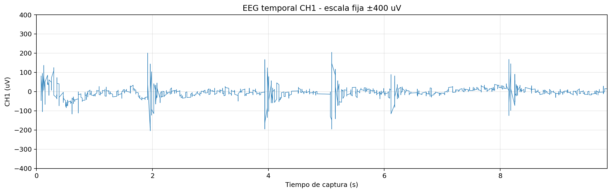

# Captura final: `precheck_10s`

## 1. Identificacion

- Carpeta: `captures/capturas finales/20260528-144607_s01_20260528_ear_eeg_ch1_only_00_precheck_10s`
- Tipo: Precheck tecnico
- Nivel de detalle documental: `brief`
- Objetivo: Comprobacion breve de contacto, streaming, guardado EEG y guardado musical.

## 2. Calidad de adquisicion

| Metrica | Valor |
| --- | ---: |
| Diagnostico | `dudosa - high 50 Hz power ratio` |
| Duracion observada | `9.60 s` |
| Frecuencia efectiva | `250.00 Hz` |
| Sample gaps | `0` |
| Invalid status | `0` |
| RMS CH1 | `29.808` |
| Pico-pico CH1 | `408` |
| Ratio 50 Hz | `0.328539` |
| Fraccion de ventanas con artefacto | `0` |

## 3. Figuras

Nota: las figuras EEG temporales estandar usan escala fija `±400 uV` para facilitar la inspeccion visual. Los transitorios completos se conservan en las metricas de calidad y, cuando procede, en las figuras enhanced.

## 4. Datos musicales

| Metrica | Valor |
| --- | ---: |
| Snapshots totales | `24` |
| Snapshots con notas | `24` |
| Notas deduplicadas | `12` |

## 5. Controles de sonificacion disponibles

| Control | Mediana | P05 | P95 |
| --- | ---: | ---: | ---: |
| `alpha_drive` | `0.418871` | `0.28705` | `0.480875` |
| `beta_gamma_drive` | `0.509642` | `0.422324` | `0.621658` |
| `rms_beta_activity` | `0.261546` | `0.246016` | `0.279334` |
| `band_driven_density` | `0.279825` | `0.220278` | `0.313106` |
| `spectral_register` | `0.525343` | `0.473495` | `0.597739` |
| `alpha_stability` | `0.394324` | `0.292038` | `0.422657` |
| `rms_band_velocity` | `0.49041` | `0.486322` | `0.512991` |
| `band_note_probability` | `0.37386` | `0.326222` | `0.400485` |

## 6. Interpretacion para el TFG

Captura conservada como trazabilidad tecnica de la sesion final.

