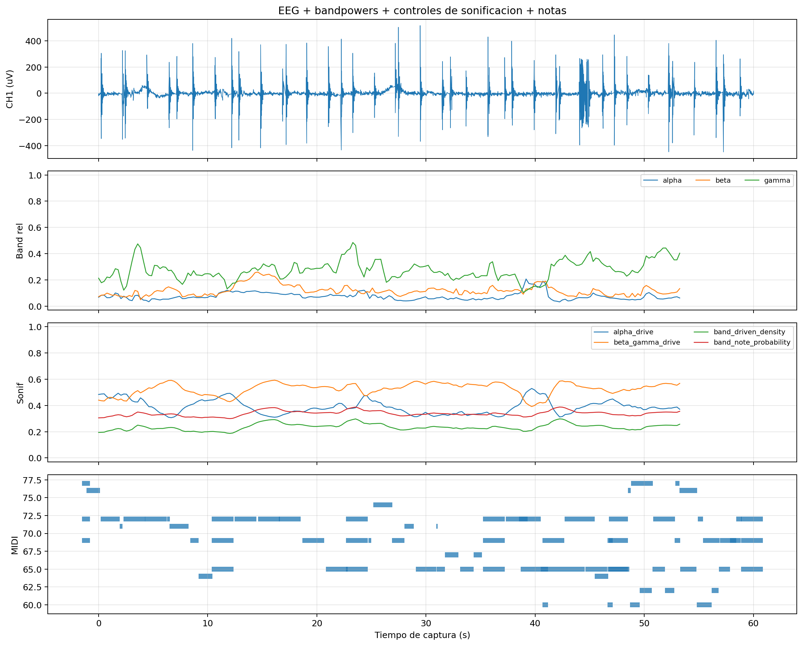

# Captura final: `eyes_closed_rest_60s`

## 1. Identificacion

- Carpeta: `captures/capturas finales/20260528-145251_s01_20260528_ear_eeg_ch1_only_02_eyes_closed_rest_60s`
- Tipo: Ojos cerrados en reposo
- Nivel de detalle documental: `full`
- Objetivo: Condicion de reposo con ojos cerrados; util para comparacion cualitativa, con cautela por 50 Hz.

## 2. Calidad de adquisicion

| Metrica | Valor |
| --- | ---: |
| Diagnostico | `dudosa` - high 50 Hz power ratio, abrupt jumps or motion artifacts |
| Duracion observada | `57.47 s` |
| Frecuencia efectiva | `250.00 Hz` |
| Sample gaps | `0` |
| Invalid status | `0` |
| RMS CH1 | `58.3981` |
| Pico-pico CH1 | `1004` |
| Ratio 50 Hz | `0.363277` |
| Fraccion de ventanas con artefacto | `0` |

## 3. Figuras

## 4. Datos musicales

| Metrica | Valor |
| --- | ---: |
| Snapshots totales | `121` |
| Snapshots con notas | `121` |
| Notas deduplicadas | `80` |

## 5. Controles de sonificacion disponibles

| Control | Mediana | P05 | P95 |
| --- | ---: | ---: | ---: |
| `alpha_drive` | `0.380486` | `0.315414` | `0.487138` |
| `beta_gamma_drive` | `0.537581` | `0.433734` | `0.583685` |
| `rms_beta_activity` | `0.249502` | `0.207008` | `0.35735` |
| `band_driven_density` | `0.234046` | `0.198424` | `0.287078` |
| `spectral_register` | `0.547803` | `0.477067` | `0.580768` |
| `alpha_stability` | `0.370762` | `0.327683` | `0.465592` |
| `rms_band_velocity` | `0.500044` | `0.453658` | `0.598207` |
| `band_note_probability` | `0.337237` | `0.308739` | `0.379663` |

## 6. Interpretacion para el TFG

Condicion real de ojos cerrados; debe interpretarse con cautela por contaminacion de 50 Hz.
