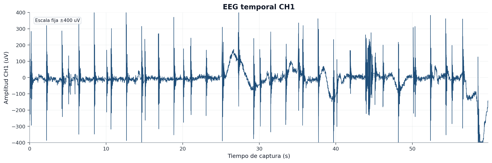
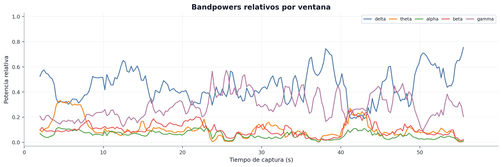
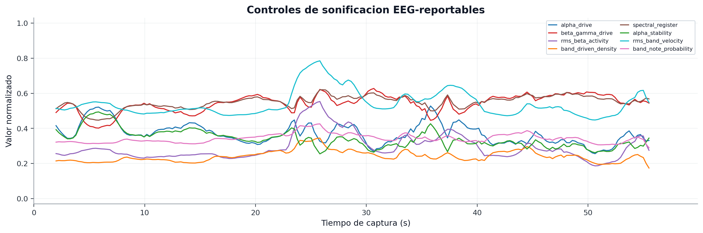
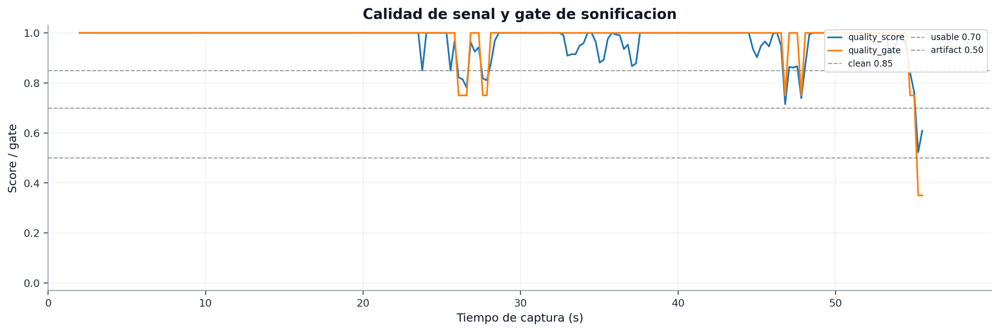
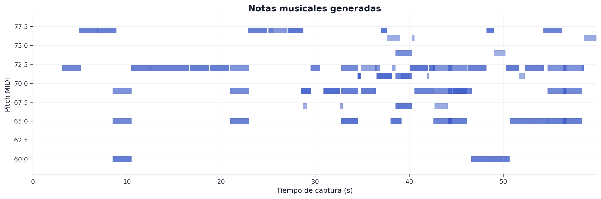

# Captura final: `quiet_rest_60s`

## 1. Identificacion

- Carpeta: `captures/capturas finales/20260528-145448_s01_20260528_ear_eeg_ch1_only_03_quiet_rest_60s`
- Tipo: Reposo quieto
- Nivel de detalle documental: `full`
- Objetivo: Condicion de reposo general; util para observar estabilidad y sonificacion.

## 2. Calidad de adquisicion

| Metrica | Valor |
| --- | ---: |
| Diagnostico | `dudosa - high 50 Hz power ratio` |
| Duracion observada | `57.54 s` |
| Frecuencia efectiva | `250.00 Hz` |
| Sample gaps | `0` |
| Invalid status | `0` |
| RMS CH1 | `82.7559` |
| Pico-pico CH1 | `1168` |
| Ratio 50 Hz | `0.338669` |
| Fraccion de ventanas con artefacto | `0.0178571` |

## 3. Figuras

Nota: las figuras EEG temporales estandar usan escala fija `±400 uV` para facilitar la inspeccion visual. Los transitorios completos se conservan en las metricas de calidad y, cuando procede, en las figuras enhanced.

## 4. Datos musicales

| Metrica | Valor |
| --- | ---: |
| Snapshots totales | `121` |
| Snapshots con notas | `121` |
| Notas deduplicadas | `72` |

## 5. Controles de sonificacion disponibles

| Control | Mediana | P05 | P95 |
| --- | ---: | ---: | ---: |
| `alpha_drive` | `0.360335` | `0.281726` | `0.496913` |
| `beta_gamma_drive` | `0.550017` | `0.440182` | `0.605277` |
| `rms_beta_activity` | `0.267374` | `0.215338` | `0.460395` |
| `band_driven_density` | `0.236697` | `0.200792` | `0.297622` |
| `spectral_register` | `0.555975` | `0.472` | `0.597605` |
| `alpha_stability` | `0.331764` | `0.270446` | `0.45241` |
| `rms_band_velocity` | `0.515668` | `0.470034` | `0.707001` |
| `band_note_probability` | `0.339358` | `0.310634` | `0.388097` |

## 6. Interpretacion para el TFG

Reposo general con sonificacion registrada; interpretacion fisiologica matizada por ruido y variabilidad de amplitud.
