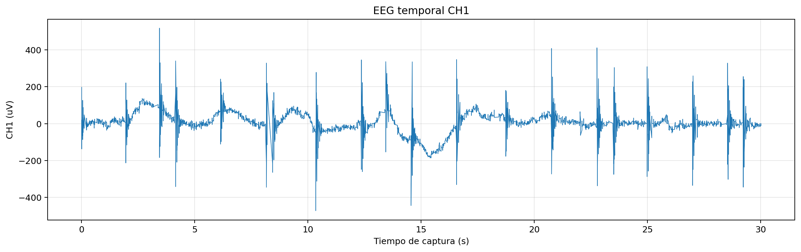
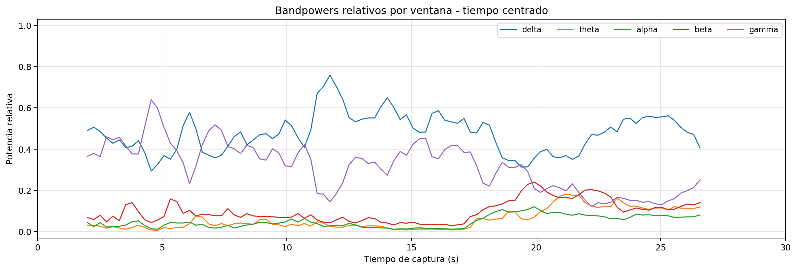
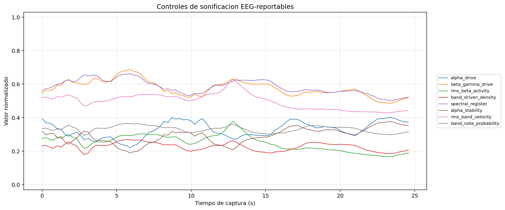
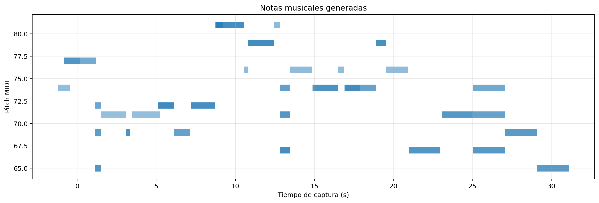

# Reportaje tecnico de la sesion final EEG-MIDI `s01_20260528`

## 1. Proposito del reportaje

Este documento organiza la sesion final de captura EEG-MIDI como un relato tecnico para el TFG. No sustituye a los CSV, JSON ni reports automaticos; los interpreta y los coloca en un orden defendible.

La idea central es clara:

```text
La sesion valida el funcionamiento integrado del sistema EEG-MIDI en una adquisicion real.
La senal EEG no es limpia en toda la sesion, pero el pipeline tecnico y la sonificacion quedaron correctamente registrados.
```

Por tanto, el reportaje no debe vender la sesion como una prueba clinica ni como un EEG ideal. Debe presentarse como una sesion realista, con tramos utiles y tramos contaminados por artefactos electronicos o fisiologicos.

## 2. Configuracion usada

| Campo | Valor |
| --- | --- |
| Sujeto anonimo | `s01` |
| Fecha | `20260528` |
| Montaje | `ear_eeg_ch1_only` |
| ADS_MODE | `bias_ch1_only_loff_off` |
| Modelo musical | `modelo_captura_final` |
| Carpeta de datos | `captures/capturas finales` |
| Documentacion detallada | `docs/validacion_tfg/reportajes_capturas_s01_20260528/` |
| Figuras matplotlib | `docs/validacion_tfg/figures/capturas_finales_s01_20260528_matplotlib/` |
| Figuras reajustadas captura 06 | `docs/validacion_tfg/figures/capturas_finales_s01_20260528_enhanced/` |

El montaje se centra en CH1. Las columnas CH2-CH4 se conservan por contrato de streaming, pero no se usan como evidencia principal de EEG en esta sesion.

## 3. Capturas que componen la sesion

| Orden | Condicion | Duracion nominal | Funcion dentro del reportaje |
| --- | --- | ---: | --- |
| 00 | `precheck_10s` | 10 s | Verificacion tecnica previa. |
| 00 | `precheck_10s` | 10 s | Segundo precheck; no se interpreta como condicion fisiologica principal. |
| 01 | `eyes_open_rest_60s` | 60 s | Ojos abiertos; contiene artefacto fuerte y sirve para discutir limitaciones reales. |
| 02 | `eyes_closed_rest_60s` | 60 s | Ojos cerrados; condicion basal con contaminacion de 50 Hz. |
| 03 | `quiet_rest_60s` | 60 s | Reposo quieto; condicion de observacion de pipeline y sonificacion sostenida. |
| 04 | `blink_artifact_30s` | 30 s | Artefacto fisiologico controlado por parpadeo. |
| 06 | `eyes_open_repeat_30s` | 30 s | Mejor candidata para figura principal combinada/reajustada. |

No se incluye captura de movimiento corporal. Tampoco se documenta como presente una condicion `05_jaw_artifact_30s`, porque no aparecio como carpeta final en la sesion subida.

## 4. Lectura global de la calidad

Todas las capturas revisadas mantienen:

- frecuencia efectiva: `250.00 Hz`;
- `sample gaps = 0`;
- `invalid status = 0`.

Esto valida la parte tecnica del sistema: adquisicion, transporte MCU-Python, escritura de CSV, generacion offline de reports y persistencia de datos musicales.

La calidad fisiologica es parcial. Hay condiciones con ruido de red, picos de amplitud y artefactos transitorios. En el TFG debe decirse expresamente que la sesion real contiene ventanas contaminadas. Aun asi, en la mayor parte de la sesion el sistema siguio generando snapshots musicales, notas y controles de sonificacion.

## 5. Tabla narrativa de resultados

| Condicion | Diagnostico | RMS CH1 (uV) | PTP CH1 (uV) | Ratio 50 Hz | Notas deduplicadas | Lectura |
| --- | --- | ---: | ---: | ---: | ---: | --- |
| `00_precheck_10s` 144607 | `dudosa` | 29.808 | 408 | 0.328539 | 12 | Check tecnico con ruido de red apreciable. |
| `00_precheck_10s` 144705 | `dudosa` | 37.4595 | 559 | 0.342103 | 22 | Segundo check tecnico, tambien con 50 Hz. |
| `01_eyes_open_rest_60s` | `dudosa` | 2199.4 | 107661 | 0.000435 | 45 | Sonificacion registrada, pero con artefacto transitorio muy grande. |
| `02_eyes_closed_rest_60s` | `dudosa` | 58.3981 | 1004 | 0.363277 | 80 | Condicion estable en transporte, contaminada por 50 Hz. |
| `03_quiet_rest_60s` | `dudosa` | 82.7559 | 1168 | 0.338669 | 72 | Reposo general con sonificacion sostenida. |
| `04_blink_artifact_30s` | `dudosa` | 67.1179 | 1025 | 0.381423 | 34 | Control de artefacto fisiologico. |
| `06_eyes_open_repeat_30s` | `valida_preliminar` | 1870.1 | 120313 | 0.00138669 | 65 | Mejor candidata para figura compuesta, aunque conserva eventos transitorios. |

## 6. Orden recomendado de lectura de las graficas

Para cada captura principal se recomienda leer las figuras en este orden:

1. **EEG temporal CH1**: permite identificar amplitud global, transitorios, saturaciones visuales y cambios de estado.
2. **Bandpowers relativos**: muestra como se reparte la energia espectral entre delta, theta, alpha, beta y gamma.
3. **Controles de sonificacion**: traduce los rasgos EEG hacia variables reportables del sistema musical.
4. **Notas musicales**: muestra la salida discreta generada por la sonificacion.

La figura combinada se conserva como archivo generado para trazabilidad y reportajes especificos, pero en este reportaje global se priorizan las graficas separadas para evitar duplicacion visual y mejorar la lectura.

## 7. Lectura por captura

### 7.1 Prechecks

Documento detallado:

- [Prechecks](reportajes_capturas_s01_20260528/00_prechecks.md)

Los prechecks muestran que la adquisicion y el guardado estaban activos antes de las condiciones largas. Tienen ruido de red y no deben ser tratados como evidencia fisiologica principal.

### 7.2 Ojos abiertos en reposo

Documento detallado:

- [01 - Ojos abiertos](reportajes_capturas_s01_20260528/01_eyes_open_rest_60s.md)

#### EEG temporal


#### Bandpowers relativos


#### Controles de sonificacion


#### Notas musicales


Esta captura es importante precisamente porque no es perfecta. El sistema registra correctamente la sesion y la musica, pero aparece un artefacto transitorio de amplitud muy elevada. En el TFG debe usarse para explicar que la adquisicion real con electrodos no siempre produce segmentos limpios y que las ventanas contaminadas deben identificarse.

### 7.3 Ojos cerrados

Documento detallado:

- [02 - Ojos cerrados](reportajes_capturas_s01_20260528/02_eyes_closed_rest_60s.md)

#### EEG temporal


#### Bandpowers relativos


#### Controles de sonificacion


#### Notas musicales


La condicion de ojos cerrados registro mas notas que ojos abiertos, pero esto no debe interpretarse automaticamente como una conclusion fisiologica. El sistema musical respondio a los controles disponibles, aunque la senal presenta contaminacion de red.

### 7.4 Reposo quieto

Documento detallado:

- [03 - Reposo quieto](reportajes_capturas_s01_20260528/03_quiet_rest_60s.md)

#### EEG temporal


#### Bandpowers relativos


#### Controles de sonificacion


#### Notas musicales


Esta captura es util como estado intermedio de reposo: no se plantea como control fisiologico perfecto, sino como evidencia de que el pipeline puede sostener adquisicion, features y musica durante una condicion real mantenida.

### 7.5 Parpadeo

Documento detallado:

- [04 - Parpadeo](reportajes_capturas_s01_20260528/04_blink_artifact_30s.md)

#### EEG temporal



#### Bandpowers relativos



#### Controles de sonificacion



#### Notas musicales



Esta condicion debe presentarse como artefacto fisiologico controlado. Su valor es mostrar que el sistema registra y conserva tambien condiciones no limpias, permitiendo analizar como la sonificacion se comporta ante contaminacion esperada.

### 7.6 Repeticion de ojos abiertos

Documento base:

- [06 - Repeticion ojos abiertos](reportajes_capturas_s01_20260528/06_eyes_open_repeat_30s.md)

Documento reajustado recomendado para resultados finales:

- [06 - Repeticion ojos abiertos reajustada](reportajes_capturas_s01_20260528/06_eyes_open_repeat_30s_reajustada.md)

#### EEG temporal


#### Bandpowers relativos


#### Controles de sonificacion


#### Notas musicales


#### Figura reajustada recomendada para memoria


Esta es la mejor candidata para figura principal de resultados porque combina adquisicion estable, notas registradas y el diagnostico automatico mas favorable de la sesion. La version reajustada permite ver la dinamica util del EEG sin que el transitorio aplaste la escala. Debe explicarse junto con la documentacion de artefactos: no se debe presentar como EEG clinico limpio, sino como ejemplo final de integracion EEG-MIDI real con trazabilidad de artefactos.

## 8. Como usar esta sesion en la memoria

Texto recomendado para la memoria:

> En la sesion final se registro una adquisicion real a 250 Hz con continuidad temporal, sin perdidas de muestras ni estados ADS1299 invalidos. La senal no fue limpia en toda la sesion, ya que aparecieron artefactos electronicos y fisiologicos, pero el sistema mantuvo el procesamiento, genero controles de sonificacion reportables y guardo las notas musicales producidas. Por ello, la sesion se considera valida como evidencia tecnica de integracion EEG-MIDI, aunque la interpretacion neurofisiologica debe realizarse con cautela.

Para la figura principal de resultados se recomienda usar la version reajustada de la captura `06_eyes_open_repeat_30s`, acompanada de la figura completa/metricas de calidad para demostrar que el transitorio final no se ha ocultado.

## 9. Conclusion

La sesion `s01_20260528` debe ocupar un lugar central en el TFG porque es la primera evidencia completa del sistema funcionando con datos reales, musica generada y documentacion por captura. Su principal fortaleza no es la limpieza absoluta de la EEG, sino la trazabilidad completa:

```text
captura real -> CSV EEG -> quality reports -> features -> controles de sonificacion -> notas -> figuras -> documentacion
```

La limitacion principal tambien queda documentada: la adquisicion real presenta artefactos. Esto no invalida el sistema; delimita honestamente el alcance experimental de la prueba.
