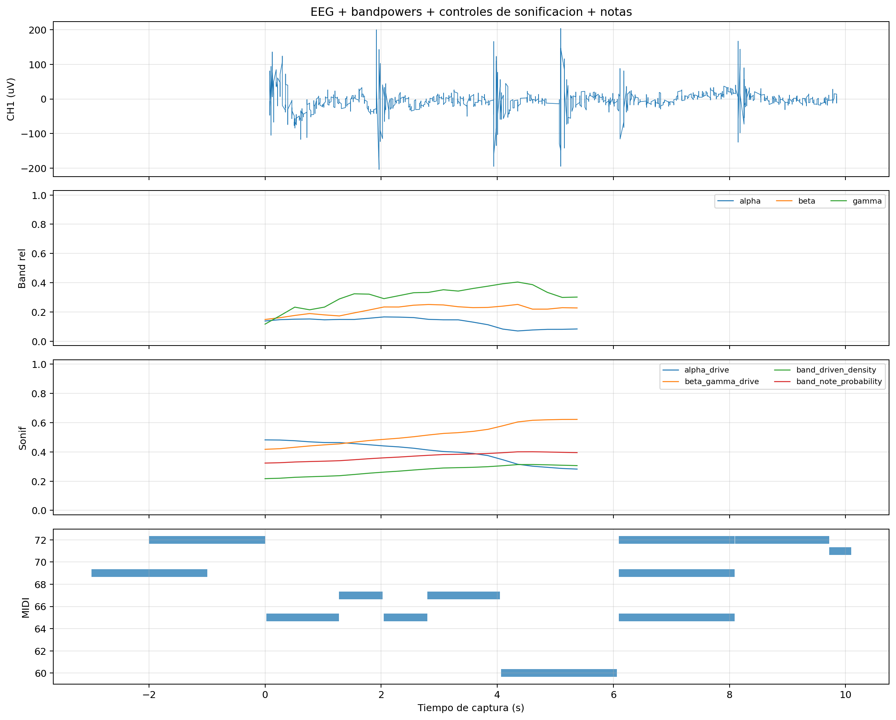
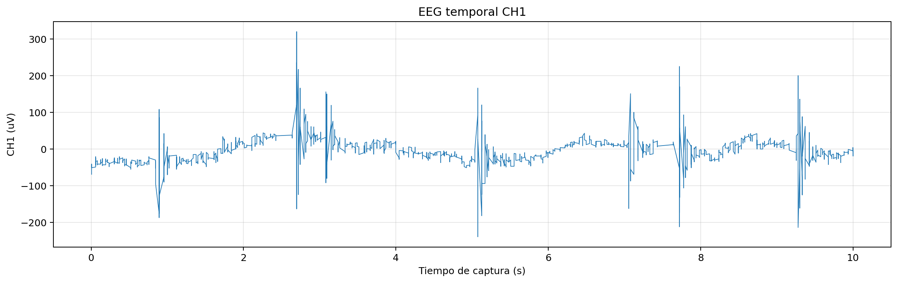
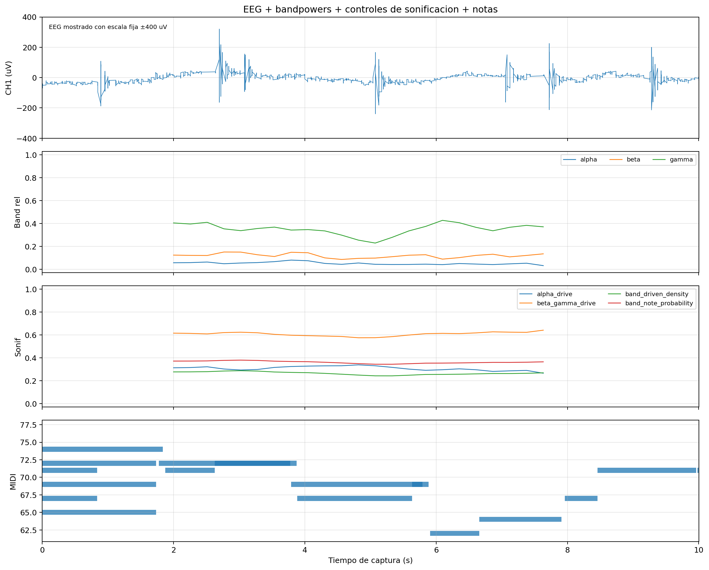

# Prechecks de la sesion final `s01_20260528`

## 1. Funcion de los prechecks

Los dos prechecks de 10 segundos no se usan como evidencia fisiologica principal. Su funcion fue comprobar que el sistema estaba preparado antes de las capturas largas:

- recepcion activa desde la placa;
- guardado de `eeg_timeseries.csv`;
- generacion de `metadata.json`;
- generacion de reports offline;
- registro de snapshots musicales;
- escritura de `music_notes.csv`.

## 2. Capturas incluidas

| Captura | Diagnostico | RMS CH1 (uV) | PTP CH1 (uV) | Ratio 50 Hz | Notas deduplicadas |
| --- | --- | ---: | ---: | ---: | ---: |
| `20260528-144607_s01_20260528_ear_eeg_ch1_only_00_precheck_10s` | `dudosa` | 29.808 | 408 | 0.328539 | 12 |
| `20260528-144705_s01_20260528_ear_eeg_ch1_only_00_precheck_10s` | `dudosa` | 37.4595 | 559 | 0.342103 | 22 |

Ambas capturas presentaron continuidad tecnica correcta, pero tambien ruido de red apreciable. Por eso se conservan como comprobacion operativa, no como figura principal.

## 3. Figuras de comprobacion

### Primer precheck

### Segundo precheck

## 4. Interpretacion

Los prechecks confirman que antes de iniciar las pruebas largas el sistema ya era capaz de adquirir y guardar datos. El ruido de 50 Hz observado no invalida su funcion, pero impide tratarlos como condiciones fisiologicas limpias.

En la memoria se pueden mencionar de forma breve como parte del protocolo experimental, sin dedicarles analisis extenso.

