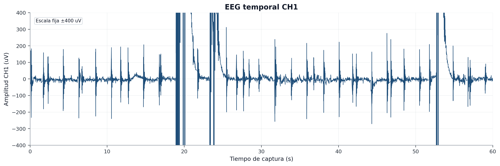
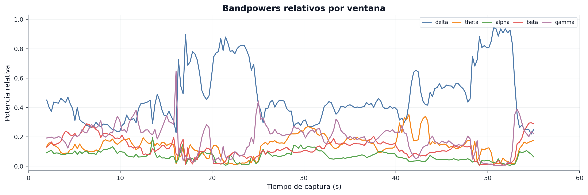
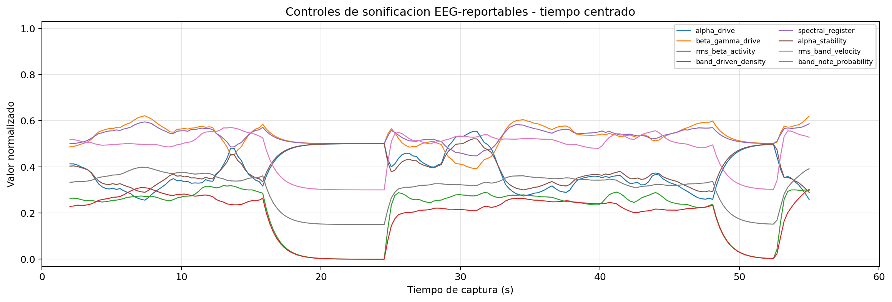
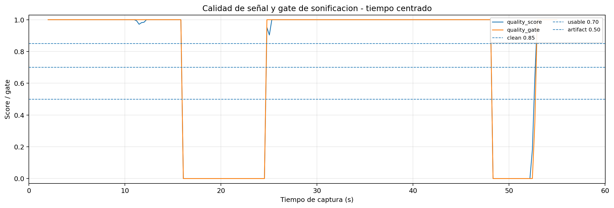
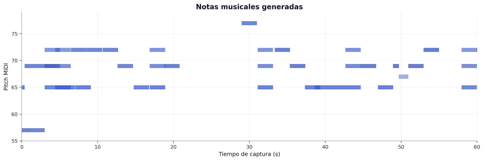

# Captura `01_eyes_open_rest_60s` - ojos abiertos en reposo

## 1. Objetivo de la condicion

Esta captura registra un estado de reposo con ojos abiertos. El sujeto permanece quieto y mirando a un punto fijo. En una sesion ideal, esta condicion serviria como referencia basal frente a ojos cerrados.

En esta sesion concreta, la captura es util por dos motivos:

1. demuestra que el pipeline completo guardo EEG, features, controles y notas durante 60 segundos;
2. muestra una limitacion real: aparece un artefacto transitorio de gran amplitud.

Por tanto, no debe presentarse como ejemplo principal de EEG limpia, sino como captura real con sonificacion registrada y artefacto documentado.

## 2. Datos tecnicos

| Campo | Valor |
| --- | --- |
| Carpeta | `captures/capturas finales/20260528-145041_s01_20260528_ear_eeg_ch1_only_01_eyes_open_rest_60s` |
| Diagnostico | `dudosa` |
| Frecuencia efectiva | `250.00 Hz` |
| Sample gaps | `0` |
| Invalid status | `0` |
| RMS CH1 | `2199.4 uV` |
| Pico-pico CH1 | `107661 uV` |
| Ratio 50 Hz | `0.000435` |
| Fraccion de ventanas con artefacto | `0.125` |
| Notas deduplicadas | `45` |

La continuidad temporal es correcta, pero la amplitud pico-pico indica un transitorio fuerte. Este punto debe quedar explicado en el TFG para no sobredimensionar la validez fisiologica de la condicion.

## 3. EEG temporal CH1

La grafica temporal es la primera que debe observarse. Permite identificar rapidamente si la senal se mantiene en rangos razonables o si aparecen transitorios que condicionan el resto del analisis.

En esta captura, el valor pico-pico elevado indica que no toda la ventana debe interpretarse como EEG fisiologica limpia. Sin embargo, eso no invalida la evidencia tecnica: el sistema siguio registrando, calculando y sonificando.

## 4. Bandpowers relativos

Los bandpowers relativos muestran como se distribuye la energia espectral por ventanas. En una captura con artefactos, esta grafica debe leerse junto con la EEG temporal: un cambio brusco de potencia puede deberse al estado fisiologico, pero tambien a movimiento, contacto, saturacion parcial o actividad muscular.

## 5. Controles de sonificacion

Los controles reportables son:

- `alpha_drive`;
- `beta_gamma_drive`;
- `rms_beta_activity`;
- `band_driven_density`;
- `spectral_register`;
- `alpha_stability`;
- `rms_band_velocity`;
- `band_note_probability`.

En esta condicion, su valor principal es demostrar que la sonificacion permanece trazable incluso cuando la senal presenta segmentos dudosos. No se deben extraer conclusiones neurofisiologicas fuertes de esta captura aislada.

## 6. Calidad de señal y quality gate

Esta grafica permite separar la interpretacion musical de la calidad de la señal. En esta captura, el artefacto transitorio obliga a interpretar las ventanas contaminadas con cautela, aunque el pipeline haya seguido funcionando.

## 7. Notas musicales generadas

Se registraron 45 notas deduplicadas. La grafica permite ver la densidad temporal y el rango de pitches generados.

La musica se considera correctamente registrada, pero su patron debe interpretarse como salida del sistema bajo una senal real con artefactos, no como marcador fisiologico directo.

## 8. Conclusión para el TFG

Esta captura se debe usar como evidencia de funcionamiento real y como ejemplo de limitacion experimental. La frase defendible seria:

> En ojos abiertos, el sistema mantuvo adquisicion continua y registro musical, pero la señal contenia un artefacto transitorio de gran amplitud. Por ello, la condicion se conserva como evidencia tecnica de integracion y como ejemplo de la necesidad de identificar ventanas contaminadas antes de realizar interpretaciones fisiologicas.

