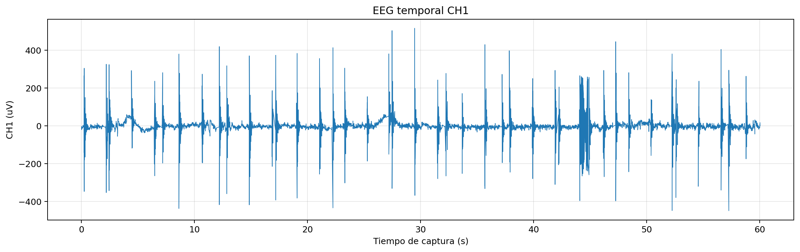
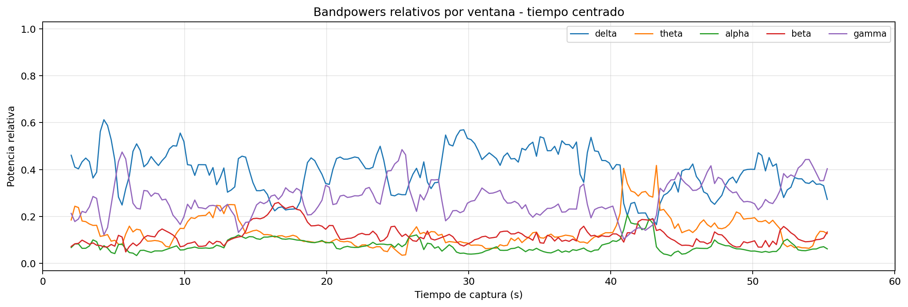
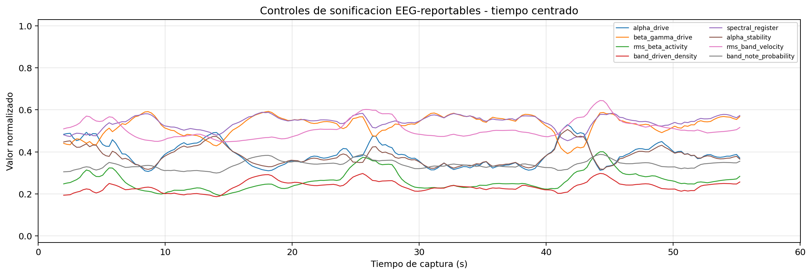
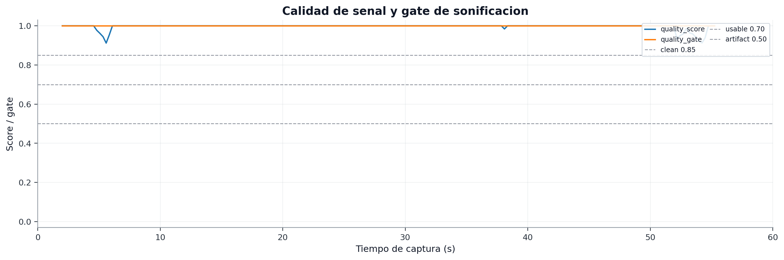
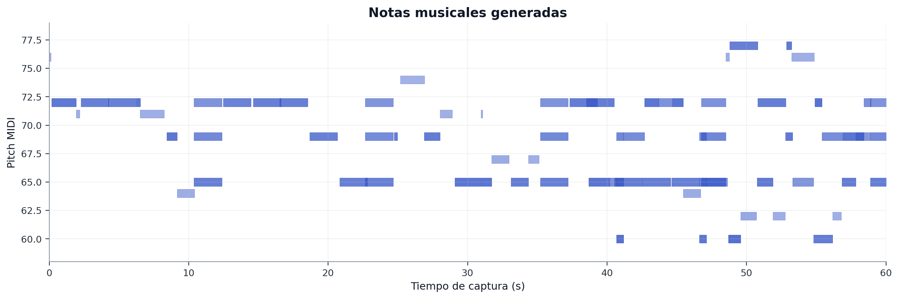

# Captura `02_eyes_closed_rest_60s` - ojos cerrados en reposo

## 1. Objetivo de la condicion

La condicion de ojos cerrados se incluye para observar la respuesta del sistema durante un estado de reposo diferente al de ojos abiertos. En EEG convencional, esta condicion puede favorecer cambios en bandas como alpha, pero en este caso la interpretacion debe ser prudente por la contaminacion observada.

El objetivo reportable no es demostrar una respuesta alpha concluyente, sino documentar que el sistema siguio adquiriendo, calculando controles y generando musica durante una condicion real de ojos cerrados.

## 2. Datos tecnicos

| Campo | Valor |
| --- | --- |
| Carpeta | `captures/capturas finales/20260528-145251_s01_20260528_ear_eeg_ch1_only_02_eyes_closed_rest_60s` |
| Diagnostico | `dudosa` |
| Frecuencia efectiva | `250.00 Hz` |
| Sample gaps | `0` |
| Invalid status | `0` |
| RMS CH1 | `58.3981 uV` |
| Pico-pico CH1 | `1004 uV` |
| Ratio 50 Hz | `0.363277` |
| Notas deduplicadas | `80` |

La amplitud global es mucho mas contenida que en la captura de ojos abiertos, pero el ratio de 50 Hz es elevado. Por tanto, la lectura fisiologica debe matizarse.

## 3. EEG temporal CH1

La señal temporal muestra una adquisicion continua sin perdida de muestras. Esta continuidad permite analizar la captura offline, aunque la presencia de ruido de red limita la interpretacion neurofisiologica.

## 4. Bandpowers relativos

Los bandpowers permiten observar la distribucion espectral durante ojos cerrados. Cualquier diferencia con ojos abiertos debe presentarse como observacion cualitativa, no como conclusion estadistica, porque solo hay un sujeto y una sesion con ruido.

## 5. Controles de sonificacion

Los controles de sonificacion se mantienen dentro del contrato reportable. Esta grafica ayuda a justificar que la musica no se genero de forma arbitraria, sino a partir de variables derivadas del analisis espectral y de amplitud.

## 6. Calidad de señal y quality gate

Esta figura permite comprobar el estado de calidad de las ventanas usadas por la sonificacion. En ojos cerrados, el ratio de 50 Hz elevado obliga a interpretar la respuesta espectral con cautela.

## 7. Notas musicales generadas

Se registraron 80 notas deduplicadas, la cifra mas alta de las condiciones principales. Esto demuestra que el sistema musical estuvo activo y genero salida durante toda la captura.

No debe afirmarse que el aumento de notas se deba directamente a ojos cerrados; se puede decir que bajo esta condicion el sistema produjo una mayor densidad musical, de acuerdo con los controles calculados en esa sesion.

## 8. Conclusión para el TFG

Esta captura debe reportarse como condicion real de ojos cerrados con adquisicion estable y sonificacion registrada, pero con contaminacion de 50 Hz. La frase defendible seria:

> En ojos cerrados, el sistema mantuvo adquisicion estable y genero una salida musical persistente. Sin embargo, el ratio de 50 Hz fue elevado, por lo que la condicion se usa como evidencia de funcionamiento del pipeline y no como demostracion fisiologica concluyente de cambios espectrales.

