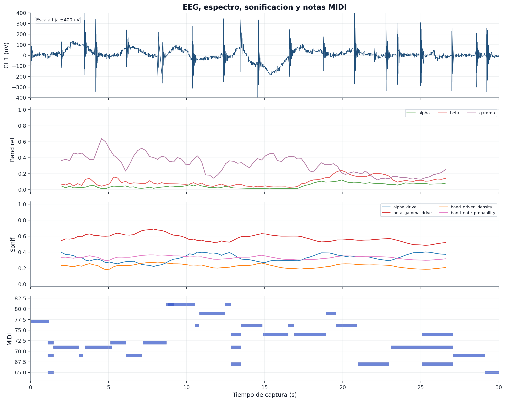

# Captura `04_blink_artifact_30s` - artefacto por parpadeo

## 1. Objetivo de la condicion

Esta captura se diseño como una condicion de artefacto fisiologico controlado. El sujeto realiza parpadeos marcados durante la captura.

No se usa para demostrar EEG limpia. Su utilidad es otra: mostrar que el sistema registra una condicion contaminada, conserva sus datos y permite analizar como se comporta la sonificacion ante artefactos esperados.

## 2. Datos tecnicos

| Campo | Valor |
| --- | --- |
| Carpeta | `captures/capturas finales/20260528-145635_s01_20260528_ear_eeg_ch1_only_04_blink_artifact_30s` |
| Diagnostico | `dudosa` |
| Frecuencia efectiva | `250.00 Hz` |
| Sample gaps | `0` |
| Invalid status | `0` |
| RMS CH1 | `67.1179 uV` |
| Pico-pico CH1 | `1025 uV` |
| Ratio 50 Hz | `0.381423` |
| Notas deduplicadas | `34` |

La adquisicion fue estable, pero el estado no debe considerarse fisiologicamente limpio por diseño experimental.

## 3. EEG temporal CH1

La grafica temporal es clave para este tipo de condicion, porque permite observar si los parpadeos generan transitorios visibles en la señal. La finalidad no es minimizar el artefacto, sino documentarlo.

## 4. Bandpowers relativos

Los bandpowers en condiciones de parpadeo deben leerse con especial cautela. Los artefactos oculares pueden afectar a la distribucion espectral y modificar los controles musicales derivados.

## 5. Controles de sonificacion

Esta grafica permite observar si el quality gate y el suavizado de sonificacion mantienen valores razonables o si el artefacto desplaza los controles. En el TFG, esta condicion puede servir para explicar la necesidad de quality gate y criterios de descarte.

## 6. Notas musicales generadas

Se registraron 34 notas deduplicadas. La salida musical existe, pero no debe interpretarse como reflejo directo de estado EEG limpio. Es la respuesta del sistema ante una señal con contaminacion fisiologica controlada.

## 7. Figura combinada

La figura combinada permite evaluar si los parpadeos coinciden con cambios en bandpowers, controles de sonificacion o densidad de notas.

## 8. Conclusión para el TFG

Esta condicion debe presentarse como captura de artefacto, no como captura limpia. Su valor es metodologico: demuestra que el protocolo no oculta los artefactos y que la documentacion permite separarlos de los estados de reposo.

Frase sugerida:

> La captura de parpadeo se incluye como artefacto fisiologico controlado. Aunque el sistema mantuvo adquisicion y sonificacion, esta condicion no se usa para validar EEG limpia, sino para documentar la respuesta del pipeline ante contaminacion fisiologica esperada.
