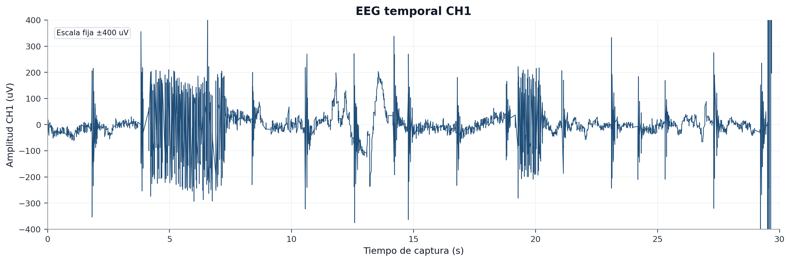
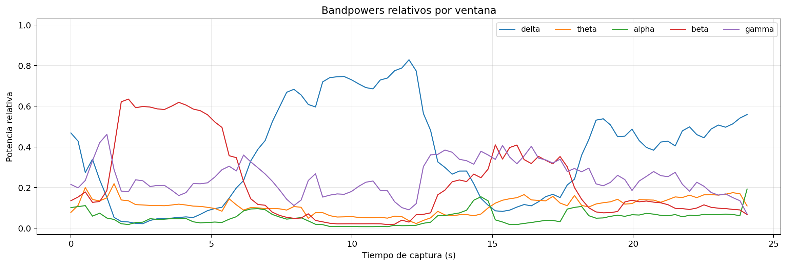
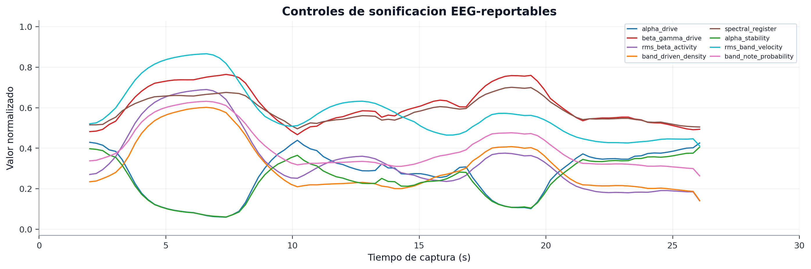
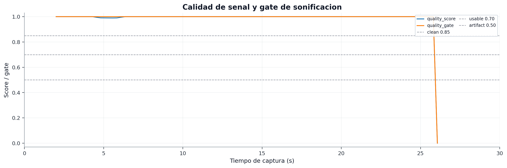
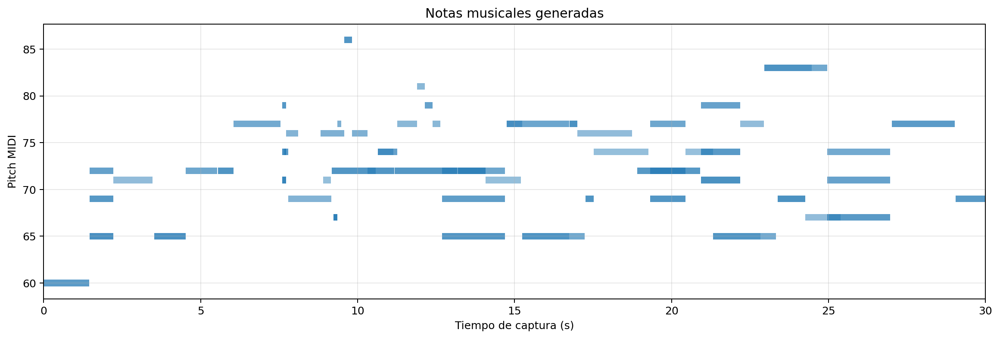

# Captura `06_eyes_open_repeat_30s` - repeticion de ojos abiertos

## 1. Motivo de seleccion

Esta captura es la mejor candidata para figura principal de la sesion final. Aunque no debe presentarse como EEG clinico perfecto, combina varios elementos favorables:

- adquisicion continua a 250 Hz;
- `sample gaps = 0`;
- `invalid status = 0`;
- salida musical persistida;
- diagnostico automatico mas favorable de la sesion: `valida_preliminar`;
- 65 notas deduplicadas;
- graficas completas generadas con matplotlib.

Por ello, es la captura mas adecuada para explicar visualmente el sistema completo: EEG real, analisis espectral, controles de sonificacion, calidad de senal y notas musicales.

## 2. Datos tecnicos

| Campo | Valor |
| --- | --- |
| Carpeta | `captures/capturas finales/20260528-145809_s01_20260528_ear_eeg_ch1_only_06_eyes_open_repeat_30s` |
| Diagnostico | `valida_preliminar` |
| Frecuencia efectiva | `250.00 Hz` |
| Sample gaps | `0` |
| Invalid status | `0` |
| RMS CH1 | `1870.1 uV` |
| Pico-pico CH1 | `120313 uV` |
| Ratio 50 Hz | `0.00138669` |
| Fraccion de ventanas con artefacto | `0.037037` |
| Notas deduplicadas | `65` |

La frecuencia efectiva, la ausencia de gaps y la ausencia de status invalidos validan el transporte. La amplitud pico-pico sigue indicando presencia de eventos transitorios, por lo que la captura debe explicarse como valida preliminar, no como registro EEG ideal.

## 3. EEG temporal CH1

Esta figura debe ser la primera del bloque de resultados porque muestra la señal real antes de cualquier interpretacion musical. Permite explicar que la adquisicion fue continua, pero que la señal real puede incluir transitorios.

El TFG debe dejar claro que la señal EEG registrada no es limpia en toda la captura. Aun asi, la estabilidad de muestreo permite usarla como evidencia de pipeline.

## 4. Bandpowers relativos

Los bandpowers relativos permiten mostrar como se alimenta la parte EEG-reportable de la sonificacion. Esta figura ayuda a conectar la señal temporal con la extraccion de rasgos espectrales.

No se debe afirmar que una banda concreta representa de forma concluyente un estado cognitivo. La lectura correcta es que el sistema calcula descriptores espectrales en tiempo real/offline y los usa como entrada musical.

## 5. Controles de sonificacion

Esta figura es central para el TFG porque muestra los nombres reportables definitivos:

- `alpha_drive`;
- `beta_gamma_drive`;
- `rms_beta_activity`;
- `band_driven_density`;
- `spectral_register`;
- `alpha_stability`;
- `rms_band_velocity`;
- `band_note_probability`.

Estos controles permiten explicar la sonificacion desde EEG y no desde etiquetas musicales abstractas.

## 6. Calidad de señal y quality gate

Esta grafica es clave para defender la captura 06: muestra que no se esta interpretando la musica de forma aislada, sino junto con un indicador de calidad de las ventanas. Permite justificar por que la captura se considera la mejor candidata de la sesion aunque conserve transitorios.

## 7. Notas musicales generadas

Se registraron 65 notas deduplicadas. La grafica de notas muestra la salida discreta del sistema musical: pitch MIDI y distribucion temporal.

Esta figura no demuestra por si sola una relacion fisiologica, pero si demuestra que el sistema produjo una salida musical persistente y guardable a partir de los controles calculados.

## 8. Orden sugerido para memoria

Para esta captura, el orden mas claro en el TFG seria:

1. presentar la figura temporal EEG;
2. explicar que la señal es real y no perfecta;
3. mostrar bandpowers para justificar el analisis espectral;
4. mostrar controles de sonificacion para justificar el mapeo EEG-musica;
5. mostrar quality score / quality gate para separar respuesta musical y calidad de senal;
6. mostrar notas musicales o la figura reajustada;
7. cerrar con la limitacion: interpretacion fisiologica preliminar.

La figura combinada se conserva como PNG y la version reajustada se documenta en `06_eyes_open_repeat_30s_reajustada.md`, pero este reportaje base evita repetirla para mantener una lectura limpia por graficas separadas.

## 9. Texto sugerido para el TFG

> La repeticion de ojos abiertos fue la captura con mejor diagnostico automatico de la sesion. Durante esta prueba, el sistema mantuvo adquisicion a 250 Hz, sin perdidas de muestras ni estados invalidos, y genero una salida musical persistente. La señal conserva transitorios de amplitud, por lo que no se interpreta como EEG clinicamente limpio; sin embargo, constituye la mejor evidencia visual de integracion completa entre adquisicion EEG, analisis espectral, controles de sonificacion, control de calidad y generacion de notas MIDI.

## 10. Conclusion

Esta captura debe ser la referencia principal de la sesion final. Su valor no esta en demostrar una fisiologia perfecta, sino en mostrar que el sistema EEG-MIDI funciona de extremo a extremo con datos reales y deja una trazabilidad completa para analisis posterior.

