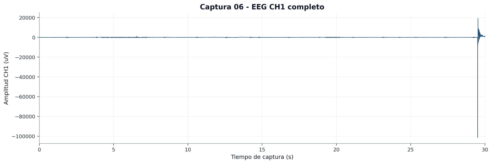
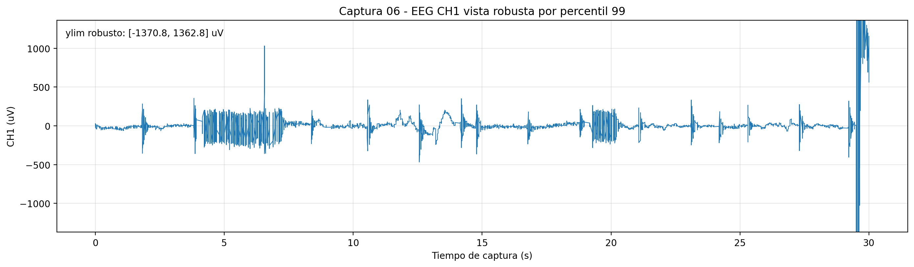
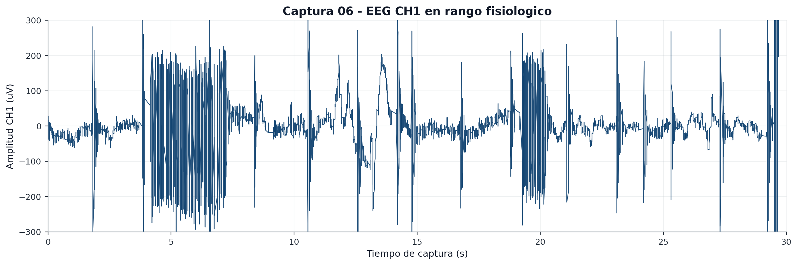
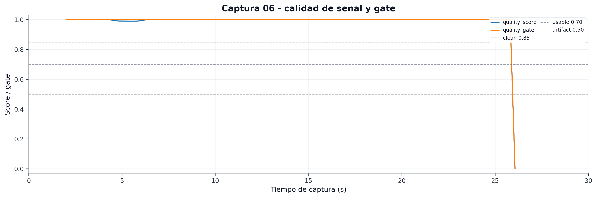
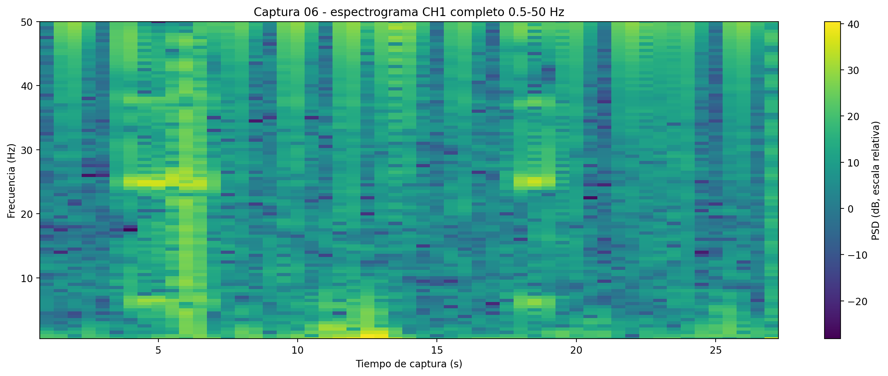
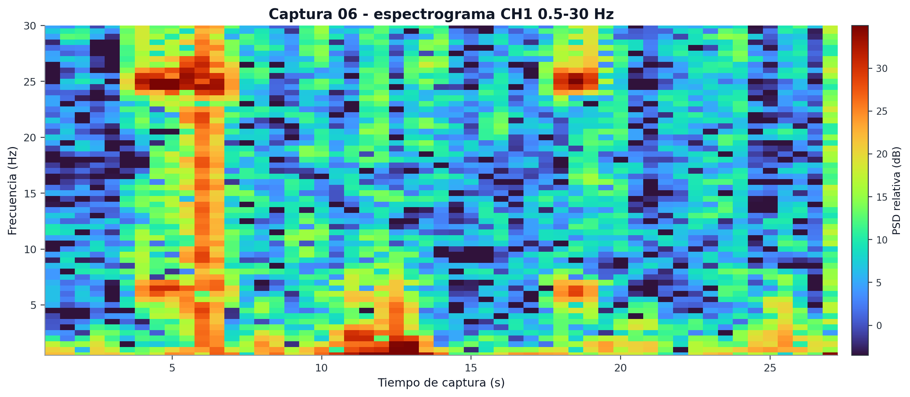
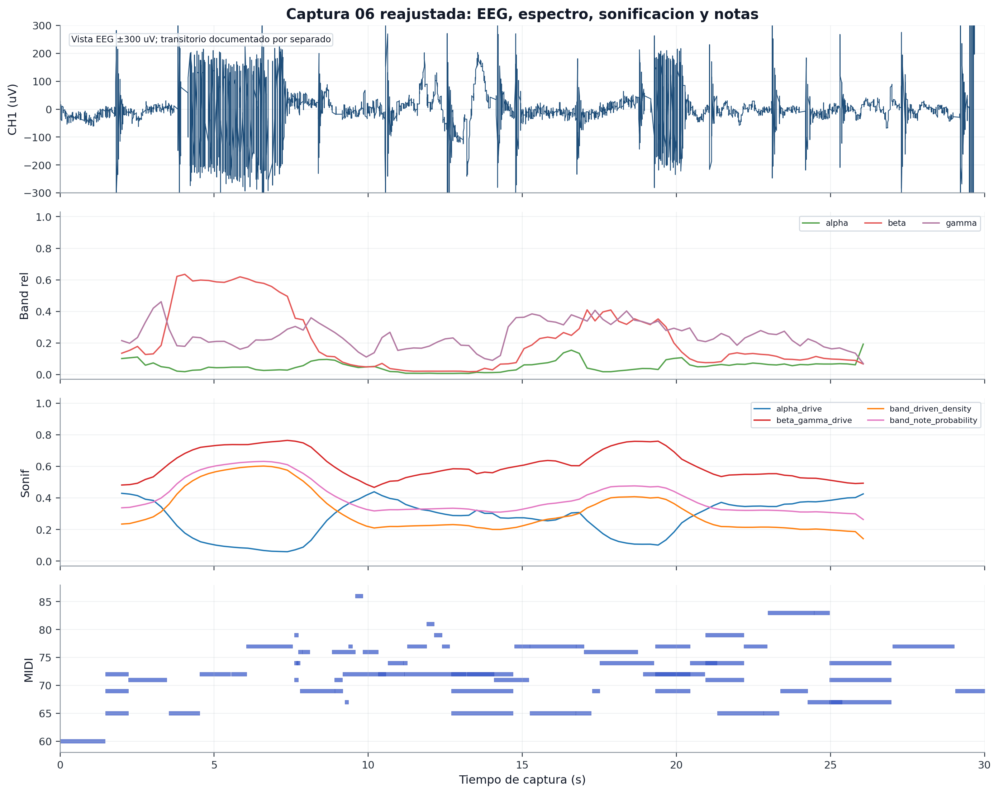

# Seccion final reajustada - captura `06_eyes_open_repeat_30s`

## 1. Motivo de esta seccion

La figura combinada original de la captura `06_eyes_open_repeat_30s` conserva toda la amplitud real de la senal. Eso es correcto para trazabilidad, pero el transitorio final obliga a que el eje vertical del EEG alcance valores del orden de decenas de miles de microvoltios. Como consecuencia, la parte util de la senal queda visualmente aplastada.

Por este motivo se generan dos lecturas complementarias:

1. **Vista completa**, donde el transitorio queda visible y no se oculta.
2. **Vista reajustada**, donde el eje EEG se limita de forma robusta para observar la dinamica principal de la captura.

La vista reajustada no sustituye a la completa. Solo sirve para explicar mejor el tramo util de la senal y su relacion con la sonificacion.

## 2. EEG completo con transitorio conservado

Esta figura conserva toda la amplitud. Es la prueba de que existe un transitorio final de gran magnitud. Debe mantenerse para no ocultar artefactos.

## 3. EEG con escala robusta por percentil

La escala robusta permite ver la mayor parte de la senal sin que el transitorio domine toda la grafica. Esta vista es util para discusion visual, pero debe explicarse que el artefacto existe y se muestra en la figura completa.

## 4. EEG con zoom fisiologico ±300 uV

Esta vista permite observar el rango en el que se concentra la mayor parte de la actividad util. No debe usarse para negar el artefacto, sino para inspeccionar la parte no dominada por el transitorio.

## 5. Quality score y quality gate

Esta grafica muestra la evolucion de la calidad por ventana. Es importante porque conecta los artefactos con la atenuacion o validacion de la sonificacion. En el TFG debe explicarse que el sistema no solo genera musica, sino que tambien calcula un indicador de calidad que permite interpretar las ventanas con cautela.

## 6. Espectrograma completo

El espectrograma permite observar la evolucion temporal del contenido espectral. Se usa una escala robusta de visualizacion para que el transitorio final no tape la estructura del resto de la captura. La paleta de alto contraste hace que las zonas de mayor potencia alcancen rojo/amarillo y que las diferencias de potencia sean mas visibles.

## 7. Espectrograma en bandas EEG hasta 30 Hz

Esta version se centra en el rango mas interpretable para la sesion, evitando dar demasiado peso visual al extremo alto donde la interpretacion de gamma es mas delicada por filtros y ruido.

## 8. Figura combinada reajustada

Esta es la figura combinada recomendada para la memoria si se quiere mostrar la relacion entre EEG, bandpowers, controles de sonificacion y notas sin que el transitorio final aplaste toda la senal.

## 9. Texto recomendado para la memoria

> La captura `06_eyes_open_repeat_30s` fue la mejor candidata de la sesion final. La figura completa muestra un transitorio de gran amplitud al final, por lo que no se presenta como EEG clinicamente limpio. Para analizar la parte util de la captura se genero una visualizacion reajustada del eje EEG, manteniendo por separado la figura completa para trazabilidad. Esta doble representacion permite documentar honestamente el artefacto y, al mismo tiempo, observar la relacion entre la actividad registrada, los bandpowers, los controles de sonificacion y las notas MIDI generadas.

## 10. Conclusion

La captura 06 debe reportarse con ambas vistas: completa y reajustada. La completa demuestra transparencia experimental; la reajustada permite interpretar la parte util y defender la integracion EEG-MIDI.

